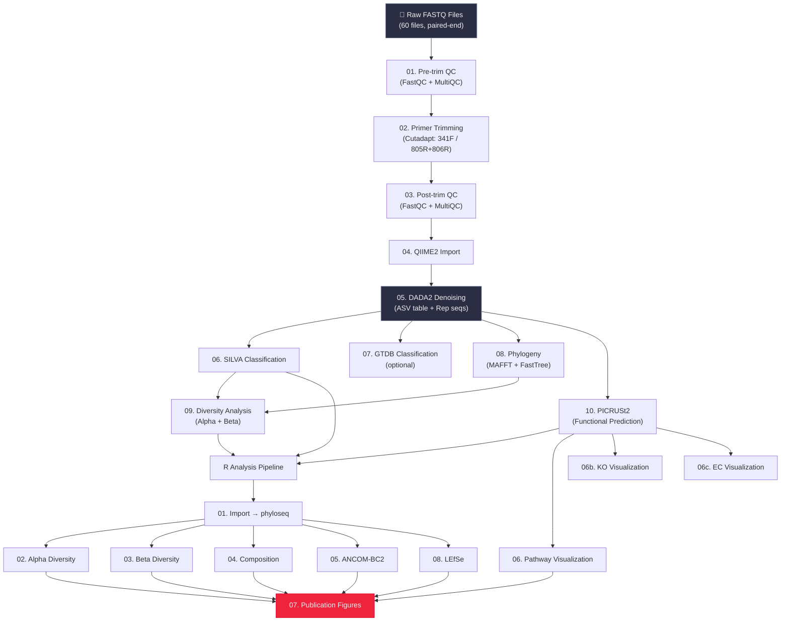

# 🧬 16S rRNA Microbiome Analysis Pipeline

## Bronchoalveolar Lavage Fluid (BALF) Microbiome in Lung Cancer With and Without COPD

[](https://qiime2.org/)
[](https://cran.r-project.org/)
[](https://opensource.org/licenses/MIT)

A comprehensive, reproducible bioinformatics pipeline for 16S rRNA gene sequencing analysis of bronchoalveolar lavage fluid (BALF) microbiome, comparing three clinical groups: **healthy controls**, **lung cancer patients with COPD (LC_COPD)**, and **lung cancer patients without COPD (LC_woCOPD)**.

---

## 📋 Table of Contents

1. [Project Overview](#-project-overview)
2. [Study Design](#-study-design)
3. [Requirements](#-requirements)
4. [Installation & Setup](#-installation--setup)
5. [Directory Structure](#-directory-structure)
6. [Pipeline Workflow](#-pipeline-workflow)
7. [Step-by-Step Execution Guide](#-step-by-step-execution-guide)
8. [R Analysis Scripts](#-r-analysis-scripts)
9. [Key Results Summary](#-key-results-summary)
10. [Output Files](#-output-files)
11. [Parameters & Configuration](#-parameters--configuration)
12. [Reproducing the Analysis](#-reproducing-the-analysis)
13. [Troubleshooting](#-troubleshooting)
14. [Citation](#-citation)
15. [Contact](#-contact)

---

## 🔬 Project Overview

This pipeline performs end-to-end 16S rRNA microbiome analysis from raw Illumina paired-end FASTQ files through to publication-quality figures. The analysis investigates microbial community differences in bronchoalveolar lavage fluid (BALF) among lung cancer patients stratified by COPD comorbidity.

### Analysis Modules

| Module | Tool(s) | Description |
|--------|---------|-------------|
| **Quality Control** | FastQC, MultiQC | Pre- and post-trimming quality assessment |
| **Primer Trimming** | Cutadapt | V3-V4 primer removal (341F / 805R+806R) |
| **Denoising** | DADA2 | Amplicon Sequence Variant (ASV) inference |
| **Taxonomy** | SILVA 138 (primary), GTDB r214 (optional) | Taxonomic classification |
| **Phylogeny** | MAFFT + FastTree | Phylogenetic tree construction |
| **Alpha Diversity** | phyloseq, vegan | Within-sample diversity (8 metrics) |
| **Beta Diversity** | phyloseq, vegan | Between-sample diversity (4 distance metrics + PCoA/NMDS) |
| **Composition** | phyloseq, ggplot2 | Phylum/Genus-level barplots, heatmaps, core microbiome, Venn diagrams |
| **Differential Abundance** | ANCOM-BC2 | Log-fold change analysis with bias correction |
| **LEfSe** | microbiomeMarker | Linear discriminant analysis Effect Size for biomarker discovery |
| **Functional Prediction** | PICRUSt2 | MetaCyc pathways, KO, and EC number predictions |
| **Visualization** | ggplot2, ComplexHeatmap | Publication-quality figures (PDF, PNG, TIFF) |

---

## 🧪 Study Design

### Sample Groups

| Group | Samples | Condition | COPD Status | Sample Type |
|-------|---------|-----------|-------------|-------------|
| **Control** | C1–C10 (n=10) | Healthy | No | BALF |
| **LC_COPD** | LC1–LC10 (n=10) | Lung Cancer | Yes | BALF |
| **LC_woCOPD** | LC11–LC20 (n=10) | Lung Cancer | No | BALF |

### Sequencing Details

- **Platform**: Illumina MiSeq
- **Read type**: Paired-end (2 × 300 bp)
- **Target region**: V3-V4 hypervariable region
- **Forward primer**: 341F (`CCTACGGGNGGCWGCAG`, 17 bp)
- **Reverse primers**: Mixed — 805R (`GACTACHVGGGTATCTAATCC`, 21 bp, ~39% detection) and 806R (`GGACTACHVGGGTWTCTAAT`, 20 bp, ~89% detection)
- **Total raw files**: 60 FASTQ files (30 samples × 2 read directions)

---

## 💻 Requirements

### Hardware

| Resource | Minimum | Recommended |
|----------|---------|-------------|
| CPU | 4 cores | 6+ cores |
| RAM | 8 GB | 11+ GB |
| Storage | 30 GB | 50+ GB free |

### Software

- **OS**: Linux or Windows Subsystem for Linux (WSL)
- **Package manager**: Conda or Mamba
- **R**: version 4.3+
- **RStudio** (optional): For interactive R analysis

### Conda Environments

The pipeline uses three separate conda environments to avoid dependency conflicts:

| Environment | Purpose | Key Packages |
|------------|---------|--------------|
| `qiime2-amplicon-2024.10` | QIIME2 processing | QIIME2, DADA2, Cutadapt, FastQC, MultiQC |
| `microbiome-r` | R statistical analysis | R, phyloseq, ANCOMBC, vegan, ggplot2, ComplexHeatmap |
| `picrust2` | Functional prediction | PICRUSt2 |

Environment YAML specs are available in the `envs/` directory.

---

## 🛠 Installation & Setup

### Step 1: Clone the Repository

```bash
git clone https://github.com/<your-username>/LC_COPD_microbiome.git
cd LC_COPD_microbiome
```

### Step 2: Run the Automated Setup Script

```bash
chmod +x scripts/*.sh
bash scripts/00_setup_environment.sh
```

This script will:
- Create the full directory structure (see [Directory Structure](#-directory-structure))
- Set up all three conda environments
- Download the **SILVA 138** classifier (~1 GB)
- Optionally prepare the **GTDB r214** database (requires RESCRIPt training or a pre-trained artifact)

### Step 3: Install Additional R Packages

```bash
conda activate microbiome-r
Rscript scripts/install_r_packages.R
```

This installs Bioconductor and CRAN packages including: `phyloseq`, `ANCOMBC`, `microbiomeMarker`, `ComplexHeatmap`, `tidyverse`, `vegan`, `ape`, `VennDiagram`, and the project's custom plotting theme.

### Step 4: Set Up renv (Reproducible R Environment)

The project uses [`renv`](https://rstudio.github.io/renv/) to lock R package versions. To restore the exact package versions used:

```bash
conda activate microbiome-r
cd LC_COPD_microbiome
Rscript -e 'renv::restore()'
```

### Step 5: Place Raw Data

Copy your raw FASTQ files into the `raw_data/` directory:

```
raw_data/
├── C1_R1.fastq.gz
├── C1_R2.fastq.gz
├── C2_R1.fastq.gz
├── ...
└── LC20_R2.fastq.gz
```

File naming convention: `{SampleID}_R{1|2}.fastq.gz`

---

## 📁 Directory Structure

```
LC_COPD_microbiome/
├── raw_data/                          # Original FASTQ files (read-only, 60 files)
├── scripts/                           # Bash pipeline scripts
│   ├── config.sh                      # Central configuration (paths, parameters)
│   ├── 00_setup_environment.sh        # Environment & directory setup
│   ├── 01_fastqc_pretrim.sh           # Pre-trimming quality check
│   ├── 02_trim_primers.sh             # Cutadapt primer removal
│   ├── 03_fastqc_posttrim.sh          # Post-trimming quality check
│   ├── 04_qiime2_import.sh            # Import FASTQs into QIIME2
│   ├── 05_dada2_denoise.sh            # DADA2 denoising (ASV inference)
│   ├── 06_taxonomy_silva.sh           # SILVA 138 classification
│   ├── 07_taxonomy_gtdb.sh            # GTDB r214 classification (optional)
│   ├── 08_phylogeny.sh                # MAFFT alignment + FastTree
│   ├── 09_diversity.sh                # Alpha & beta diversity (QIIME2)
│   ├── 10_picrust2.sh                 # PICRUSt2 functional prediction
│   ├── install_r_packages.R           # R package installer
│   └── optimize_dada2_params.R        # DADA2 parameter grid-search
├── R_analysis/                        # R analysis scripts
│   ├── 01_import_phyloseq.R           # Import QIIME2 → phyloseq
│   ├── 02_alpha_diversity.R           # Alpha diversity analysis
│   ├── 03_beta_diversity.R            # Beta diversity & ordination
│   ├── 04_composition.R               # Taxonomic composition & core microbiome
│   ├── 05_ancombc2.R                  # ANCOM-BC2 differential abundance
│   ├── 06_picrust_visualization.R     # PICRUSt2 pathway visualization
│   ├── 06b_ko_visualization.R         # KEGG Ortholog (KO) visualization
│   ├── 06c_ec_visualization.R         # Enzyme Commission (EC) visualization
│   ├── 07_publication_plots.R         # Publication-quality composite figures
│   ├── 08_lefse.R                     # LEfSe biomarker analysis
│   ├── functions/
│   │   └── plotting_theme.R           # Shared publication plotting theme
│   └── data/                          # Intermediate R data objects (.rds)
├── results/
│   ├── qc_reports/                    # FastQC & MultiQC outputs
│   ├── trimmed_reads/                 # Primer-trimmed sequences
│   ├── qiime2/                        # QIIME2 artifacts (.qza / .qzv)
│   │   ├── imported/                  # Imported sequences
│   │   ├── dada2_output/              # ASV table & rep seqs
│   │   ├── taxonomy_silva/            # SILVA classification
│   │   ├── taxonomy_gtdb/             # GTDB classification
│   │   ├── phylogeny/                 # Phylogenetic tree
│   │   └── diversity/                 # QIIME2 diversity outputs
│   ├── dada2_optimization/            # Parameter grid-search results
│   ├── picrust2/                      # PICRUSt2 output tables
│   │   ├── picrust2_out/              # Full PICRUSt2 output
│   │   ├── pathways_with_descriptions.tsv
│   │   ├── KO_metagenome_with_descriptions.tsv
│   │   └── EC_metagenome_with_descriptions.tsv
│   └── tables/                        # Exported data tables (CSV/TSV)
│       ├── asv_counts.tsv             # Raw ASV count table
│       ├── taxonomy_silva.tsv         # SILVA taxonomy assignments
│       ├── dada2_stats.tsv            # DADA2 processing statistics
│       ├── alpha_diversity_values.csv
│       ├── alpha_diversity_kruskal_wallis.csv
│       ├── beta_diversity_permanova.csv
│       ├── beta_diversity_pairwise_permanova.csv
│       ├── ancombc2_significant.csv
│       ├── composition_phylum.csv / composition_genus.csv
│       ├── core_microbiome.csv
│       ├── pathway_significant.csv / ko_significant.csv / ec_significant.csv
│       ├── pval_filtered/             # P-value filtered ANCOM-BC2 results
│       └── lefse/                     # LEfSe marker tables
├── figures/
│   ├── alpha_diversity/               # Alpha diversity plots
│   ├── beta_diversity/                # PCoA, NMDS ordinations
│   ├── composition/                   # Barplots, heatmaps, Venn diagrams
│   ├── differential_abundance/        # Volcano plots, ANCOM-BC2
│   ├── functional/                    # PICRUSt2 pathway/KO/EC figures
│   ├── lefse/                         # LEfSe LDA bar plots & cladograms
│   ├── qc/                            # Quality control plots
│   └── publication/                   # Final publication-ready figures
├── metadata/
│   ├── sample_metadata.tsv            # Sample metadata (group, disease, COPD, sample type)
│   └── manifest.tsv                   # QIIME2 import manifest
├── databases/
│   ├── silva/                         # SILVA 138-99 classifier
│   └── gtdb/                          # GTDB r214 classifier
├── envs/                              # Conda environment YAML specs
│   ├── qiime2-env.yml
│   ├── r-microbiome-env.yml
│   └── picrust2-env.yml
├── logs/                              # Pipeline execution logs
├── renv/                              # R package version lock (renv)
├── renv.lock                          # Exact R package versions
├── LC_COPD_microbiome.Rproj           # RStudio project file
└── README.md                          # This file
```

---

## 🔄 Pipeline Workflow



---

## 🚀 Step-by-Step Execution Guide

> **Note:** All bash scripts should be run from the project root directory. Each script sources `config.sh` for shared parameters.

### Phase 1: Quality Control & Trimming

```bash
cd /path/to/LC_COPD_microbiome

# Step 0: One-time setup (environments, databases, directories)
bash scripts/00_setup_environment.sh

# Step 1: Pre-trimming quality assessment
bash scripts/01_fastqc_pretrim.sh
# Output: results/qc_reports/pretrim_fastqc/ + MultiQC report

# Step 2: Primer trimming with Cutadapt
# Removes 341F and mixed 805R/806R primers
# Both primers are searched for and trimmed simultaneously
bash scripts/02_trim_primers.sh
# Output: results/trimmed_reads/

# Step 3: Post-trimming quality assessment
bash scripts/03_fastqc_posttrim.sh
# Output: results/qc_reports/posttrim_fastqc/ + MultiQC report
```

### Phase 2: QIIME2 Processing

```bash
# Step 4: Import trimmed reads as QIIME2 artifact
bash scripts/04_qiime2_import.sh
# Output: results/qiime2/imported/

# Step 5: DADA2 denoising (~2-4 hours)
# Uses optimized parameters: truncLen F=275, R=220; maxEE F=2, R=4
bash scripts/05_dada2_denoise.sh
# Output: results/qiime2/dada2_output/, results/tables/dada2_stats.tsv

# Step 6: Taxonomy assignment with SILVA 138
bash scripts/06_taxonomy_silva.sh
# Output: results/qiime2/taxonomy_silva/, results/tables/taxonomy_silva.tsv

# Step 7 (Optional): Taxonomy assignment with GTDB r214
bash scripts/07_taxonomy_gtdb.sh
# Output: results/qiime2/taxonomy_gtdb/

# Step 8: Phylogenetic tree construction
bash scripts/08_phylogeny.sh
# Output: results/qiime2/phylogeny/, results/tables/phylogenetic_tree.nwk
```

### Phase 3: Diversity & Functional Analysis

```bash
# Step 9: Alpha and beta diversity (QIIME2)
bash scripts/09_diversity.sh
# Output: results/qiime2/diversity/, results/tables/

# Step 10: PICRUSt2 functional prediction (~1-2 hours)
bash scripts/10_picrust2.sh
# Output: results/picrust2/
```

### Phase 4: R Statistical Analysis

```bash
conda activate microbiome-r
cd R_analysis

# 01. Import QIIME2 artifacts into R phyloseq object
Rscript 01_import_phyloseq.R

# 02. Alpha diversity (Kruskal-Wallis, Wilcoxon, rarefaction curves)
Rscript 02_alpha_diversity.R

# 03. Beta diversity (PERMANOVA, PERMDISP, PCoA, NMDS)
Rscript 03_beta_diversity.R

# 04. Taxonomic composition (barplots, heatmaps, core microbiome, Venn diagrams)
Rscript 04_composition.R

# 05. Differential abundance (ANCOM-BC2 for each group comparison)
Rscript 05_ancombc2.R

# 06a. Functional pathway visualization (MetaCyc pathways)
Rscript 06_picrust_visualization.R

# 06b. KEGG Ortholog (KO) visualization
Rscript 06b_ko_visualization.R

# 06c. Enzyme Commission (EC) number visualization
Rscript 06c_ec_visualization.R

# 07. Generate all publication-quality composite figures
Rscript 07_publication_plots.R

# 08. LEfSe biomarker analysis (requires microbiomeMarker package)
Rscript 08_lefse.R
```

### One-Command Pipeline (Expert Mode)

```bash
# Run all bash scripts sequentially with logging
cd /path/to/LC_COPD_microbiome
for script in scripts/{01..10}*.sh; do
    echo "Running: $script"
    bash "$script" 2>&1 | tee "logs/$(basename $script .sh).log"
done

# Run all R scripts with logging
conda activate microbiome-r
for script in R_analysis/{01..08}*.R; do
    echo "Running: $script"
    Rscript "$script" 2>&1 | tee "logs/$(basename $script .R).log"
done
```

---

## 📊 R Analysis Scripts

### `01_import_phyloseq.R` — Data Import & Filtering

Imports QIIME2 artifacts (ASV table, taxonomy, phylogenetic tree, metadata) into a **phyloseq** object. Applies filtering to remove low-abundance/prevalence ASVs. Saves both raw and filtered phyloseq objects as `.rds` files.

### `02_alpha_diversity.R` — Alpha Diversity

Computes 8 alpha diversity indices:
- **Observed**, **Chao1**, **ACE** (richness)
- **Shannon**, **Simpson**, **Inverse Simpson**, **Fisher** (evenness/diversity)
- **Pielou's Evenness**

Statistical testing via Kruskal-Wallis (omnibus) and pairwise Wilcoxon rank-sum tests. Generates rarefaction curves to evaluate sequencing depth sufficiency.

### `03_beta_diversity.R` — Beta Diversity

Calculates four distance matrices:
- **Bray-Curtis** (abundance-weighted)
- **Jaccard** (presence/absence)
- **Weighted UniFrac** (phylogenetic + abundance)
- **Unweighted UniFrac** (phylogenetic only)

Statistical testing: PERMANOVA (adonis2, 999 permutations), pairwise PERMANOVA, and PERMDISP (betadisper) for homogeneity of dispersion. Generates PCoA and NMDS ordination plots.

### `04_composition.R` — Taxonomic Composition

Generates phylum- and genus-level stacked barplots (per sample and per group means), a top-30 genus heatmap (ComplexHeatmap), prevalence-abundance scatter, core microbiome analysis (prevalence ≥ 70%, detection threshold ≥ 0.01%), and a Venn diagram of shared/unique core taxa.

### `05_ancombc2.R` — Differential Abundance

Applies ANCOM-BC2 at the genus level with bias correction. Tests LC_COPD vs Control and LC_woCOPD vs Control. Produces volcano plots of log-fold changes with q-value-based significance. Saves both q-value and p-value filtered results.

### `06_picrust_visualization.R` / `06b_ko_visualization.R` / `06c_ec_visualization.R` — Functional Predictions

Visualizes PICRUSt2 predicted functional profiles:
- **MetaCyc pathways** (`06_picrust_visualization.R`)
- **KEGG Orthologs** (`06b_ko_visualization.R`)
- **Enzyme Commission numbers** (`06c_ec_visualization.R`)

Each script generates PCA ordinations, top-30 heatmaps, differential analysis (Kruskal-Wallis), and significant feature barplots. PERMANOVA tests functional community-level differences between groups.

### `07_publication_plots.R` — Publication Figures

Assembles publication-ready composite figures from individual analyses. Outputs in PDF, PNG, and TIFF formats at journal-quality resolution (300 DPI).

### `08_lefse.R` — LEfSe Biomarker Analysis

Runs Linear discriminant analysis Effect Size (LEfSe) using the `microbiomeMarker` R package. Identifies genus-level biomarker taxa distinguishing the three clinical groups. Generates LDA score barplots and cladograms.

---

## 📈 Key Results Summary

### DADA2 Processing Statistics

| Metric | Value |
|--------|-------|
| Total input reads | 1,395,788 |
| Mean input reads/sample | 46,526 |
| Mean non-chimeric reads/sample | 18,504 |
| Mean retention rate | 39.7% |
| DADA2 parameters | truncLen F=275, R=220; maxEE F=2, R=4 |
| Total ASVs identified | Thousands (before filtering) |

> **DADA2 parameter optimization**: A grid-search across 36 parameter combinations (truncLen_F: 260/270/280, truncLen_R: 210/220/230/240, maxEE: (2,2)/(2,3)/(3,2)/(3,3)) was performed. The selected parameters (F=275, R=220, maxEE F=2, R=4) balanced read retention (~40%) with sufficient overlap (≥20 bp) for the ~460 bp V3-V4 amplicon, while using slightly relaxed maxEE for reverse reads to account for their typically lower quality.

### Sample Summary

| Group | N | Mean Reads | SD | Mean ASVs | SD |
|-------|---|-----------|-----|-----------|-----|
| Control | 10 | 18,872 | 4,753 | 321 | 167 |
| LC_COPD | 10 | 17,465 | 3,647 | 364 | 143 |
| LC_woCOPD | 10 | 17,174 | 3,123 | 359 | 143 |

### Alpha Diversity

All alpha diversity metrics showed **no statistically significant differences** (adjusted p > 0.05) across the three groups by Kruskal-Wallis test:

| Metric | H statistic | p-value | Adjusted p | Significance |
|--------|-------------|---------|------------|--------------|
| Observed | 0.899 | 0.638 | 0.652 | ns |
| Shannon | 3.440 | 0.179 | 0.579 | ns |
| Simpson | 2.480 | 0.289 | 0.579 | ns |
| Chao1 | 0.856 | 0.652 | 0.652 | ns |
| Pielou | 2.766 | 0.251 | 0.579 | ns |

> **Interpretation**: Similar species richness and evenness across groups suggests that overall community diversity is not globally altered in lung cancer patients. However, compositional differences may exist at the individual taxon or functional level (see below).

### Beta Diversity (PERMANOVA)

Community composition differed significantly between groups for multiple distance metrics (999 permutations):

| Distance Metric | R² | F | p-value | Adj. p |
|------------------|----|---|---------|--------|
| **Bray-Curtis** | 0.132 | 2.050 | 0.021 | **0.042** |
| **Jaccard** | 0.089 | 1.319 | 0.001 | **0.004** |
| Weighted UniFrac | 0.139 | 2.187 | 0.054 | 0.054 |
| **Unweighted UniFrac** | 0.083 | 1.229 | 0.033 | **0.044** |

PERMDISP tests confirmed **homogeneous dispersion** (p > 0.05 for all metrics), validating PERMANOVA results.

**Pairwise comparisons** (Bray-Curtis):
- Control vs LC_woCOPD: R² = 0.126, **p = 0.045** ✓
- LC_COPD vs LC_woCOPD: R² = 0.100, **p = 0.045** ✓
- Control vs LC_COPD: R² = 0.081, p = 0.122 (ns)

> **Interpretation**: The LC_woCOPD group shows the most distinct microbiome composition, differing significantly from both Control and LC_COPD groups.

### Differential Abundance (ANCOM-BC2)

Three genera showed significant differential abundance (q-value < 0.05):

| Genus | Phylum | LC_COPD vs Control | LC_woCOPD vs Control |
|-------|--------|-------------------|---------------------|
| ***Neisseria*** | Proteobacteria | **↑ LFC=2.76** (q=0.007) | LFC=1.28 (ns) |
| ***Cetobacterium*** | Fusobacteriota | LFC=1.71 (ns) | **↑ LFC=1.92** (q=0.027) |
| ***Gemella*** | Firmicutes | LFC=1.08 (ns) | **↑ LFC=1.82** (q=0.035) |

With relaxed p-value filtering (p < 0.05), additional differentially abundant taxa were identified including *Streptococcus*, *Alloprevotella*, *Leptotrichia*, *Corynebacterium*, and the Rikenellaceae RC9 gut group.

### Functional Predictions (PICRUSt2)

PICRUSt2 analysis predicted **48 MetaCyc pathways**, **654 KOs**, and **179 ECs** with nominally significant differences (p < 0.05), though none survived FDR correction. Top pathways included:

| Pathway | Description | Trend |
|---------|-------------|-------|
| GLYCOCAT-PWY | Glycogen degradation I | ↑ in LC groups |
| P441-PWY | N-acetylneuraminate degradation | ↑ in LC_COPD |
| PWY-5913 | TCA cycle VI | ↑ in LC groups |
| FASYN-ELONG-PWY | Fatty acid elongation (saturated) | ↓ in LC groups |
| PWY-6471 | Peptidoglycan biosynthesis IV | ↑ in LC_COPD |

---

## 📄 Output Files

### Key Data Tables

| File | Description |
|------|-------------|
| `results/tables/asv_counts.tsv` | Raw ASV count table (all samples × ASVs) |
| `results/tables/asv_counts_filtered_silva.tsv` | Filtered ASV table after taxonomy-based QC |
| `results/tables/taxonomy_silva.tsv` | SILVA taxonomic assignments |
| `results/tables/dada2_stats.tsv` | Per-sample DADA2 processing statistics |
| `results/tables/alpha_diversity_values.csv` | Per-sample alpha diversity indices |
| `results/tables/alpha_diversity_kruskal_wallis.csv` | Kruskal-Wallis test results |
| `results/tables/beta_diversity_permanova.csv` | Omnibus PERMANOVA results |
| `results/tables/beta_diversity_pairwise_permanova.csv` | Pairwise PERMANOVA results |
| `results/tables/beta_diversity_dispersion.csv` | PERMDISP results |
| `results/tables/ancombc2_results.csv` | Full ANCOM-BC2 output |
| `results/tables/ancombc2_significant.csv` | Significant taxa (q < 0.05) |
| `results/tables/composition_phylum.csv` | Phylum-level relative abundance |
| `results/tables/composition_genus.csv` | Genus-level relative abundance |
| `results/tables/core_microbiome.csv` | Core microbiome taxa |
| `results/tables/pathway_significant.csv` | Significant MetaCyc pathways |
| `results/tables/ko_significant.csv` | Significant KEGG Orthologs |
| `results/tables/ec_significant.csv` | Significant Enzyme Commission numbers |
| `results/tables/distance_matrix_*.csv` | Beta diversity distance matrices |
| `results/tables/phylogenetic_tree.nwk` | Newick-format phylogenetic tree |

### Publication Figures

| Figure | Description | Formats |
|--------|-------------|---------|
| `Figure1_alpha_diversity` | Alpha diversity boxplots across groups | PDF, PNG, TIFF |
| `Figure2_beta_diversity` | PCoA ordination (4 metrics combined) | PDF, PNG, TIFF |
| `Figure3_composition` | Taxonomic composition barplots | PDF, PNG, TIFF |
| `Figure4_differential_abundance` | ANCOM-BC2 differential abundance | PDF, PNG, TIFF |
| `Figure5_functional_pathways` | PICRUSt2 pathway analysis | PDF, PNG, TIFF |
| `FigureS1_rarefaction` | Rarefaction curves | PDF, PNG |
| `FigureS2_volcano_plots` | Volcano plots per comparison | PDF, PNG, TIFF |
| `FigureS3a_genus_heatmap` | Genus-level abundance heatmap | PDF, PNG |
| `FigureS3b_core_venn` | Core microbiome Venn diagram | PNG |
| `FigureS4_ko_ec_barplots` | KO & EC significant barplots | PDF, PNG, TIFF |
| `Table1_sample_summary` | Sample group summary statistics | CSV |

All figures are generated at **300 DPI** resolution for journal submission.

---

## ⚙ Parameters & Configuration

All pipeline parameters are centrally defined in `scripts/config.sh`. Key parameters:

### Computational Resources

| Parameter | Default | Description |
|-----------|---------|-------------|
| `THREADS` | 6 | CPU threads (Ryzen 5 8645HS: 6 cores) |
| `MAX_MEMORY` | 10G | Memory limit (~11 GB available) |

### Primer Trimming

| Parameter | Value | Description |
|-----------|-------|-------------|
| `FORWARD_PRIMER` | `CCTACGGGNGGCWGCAG` | 341F forward primer (17 bp) |
| `REVERSE_PRIMER_805R` | `GACTACHVGGGTATCTAATCC` | 805R reverse primer (21 bp) |
| `REVERSE_PRIMER_806R` | `GGACTACHVGGGTWTCTAAT` | 806R reverse primer (20 bp) |

### DADA2 Parameters

| Parameter | Value | Rationale |
|-----------|-------|-----------|
| `TRUNC_LEN_F` | 275 | Optimized via grid-search; maintains quality & overlap |
| `TRUNC_LEN_R` | 220 | Ensures ≥20 bp overlap for ~460 bp V3-V4 amplicon |
| `MAX_EE_F` | 2 | Standard stringency for forward reads |
| `MAX_EE_R` | 4 | Slightly relaxed for lower-quality reverse reads |
| `TRUNC_Q` | 2 | Truncate reads at first base with quality ≤ 2 |
| `CHIMERA_METHOD` | consensus | Chimera removal strategy |
| `RANDOM_SEED` | 42 | For reproducibility |

### Diversity Parameters

| Parameter | Value |
|-----------|-------|
| `ALPHA_METRICS` | observed_features, shannon, simpson, faith_pd, pielou_e, chao1 |
| `BETA_METRICS` | bray_curtis, jaccard, weighted_unifrac, unweighted_unifrac |

### Databases

| Database | Version | Purpose |
|----------|---------|---------|
| SILVA | 138-99-515-806 | Primary taxonomic classifier |
| GTDB | r214 | Alternative / validation classifier |

---

## 🔁 Reproducing the Analysis

### Full Reproducibility Checklist

1. **Random seed**: Set to `42` throughout all scripts (bash and R)
2. **R packages**: Exact versions locked via `renv.lock` — restore with `renv::restore()`
3. **Conda environments**: Exported in `envs/*.yml`
4. **Parameters**: All in `scripts/config.sh` (no hard-coded values in individual scripts)
5. **Logs**: Execution logs in `logs/` directory with timestamps

### Export Environment for Reproducibility

```bash
# Export QIIME2 environment
conda activate qiime2-amplicon-2024.10
conda env export > envs/qiime2-env-export.yml

# Export R environment
conda activate microbiome-r
conda env export > envs/r-microbiome-env-export.yml

# Export PICRUSt2 environment
conda activate picrust2
conda env export > envs/picrust2-env-export.yml
```

### Software Versions

Record all versions:

```bash
conda activate qiime2-amplicon-2024.10
qiime info
conda list > logs/qiime2_packages.txt

conda activate microbiome-r
R --version
Rscript -e 'sessionInfo()' > logs/r_session_info.txt

conda activate picrust2
picrust2_pipeline.py --version
```

---

## 🔧 Troubleshooting

### Common Issues

**1. QIIME2 environment not found**

```bash
# Install using official method
wget https://data.qiime2.org/distro/amplicon/qiime2-amplicon-2024.10-py39-linux-conda.yml
conda env create -n qiime2-amplicon-2024.10 \
    --file qiime2-amplicon-2024.10-py39-linux-conda.yml
```

**2. Out of memory during DADA2 denoising**

```bash
# Reduce threads and memory in config.sh
export THREADS=4
export MAX_MEMORY="8G"
# Or run on a machine with more RAM
```

**3. R package installation fails**

```r
# Install Bioconductor packages directly
if (!requireNamespace("BiocManager", quietly = TRUE))
    install.packages("BiocManager")
BiocManager::install("ANCOMBC", ask = FALSE)
BiocManager::install("phyloseq", ask = FALSE)
BiocManager::install("microbiomeMarker", ask = FALSE)

# For ComplexHeatmap
BiocManager::install("ComplexHeatmap", ask = FALSE)
```

**4. GTDB classifier not available**

- The GTDB classifier requires training with RESCRIPt or downloading a pre-trained version.
- SILVA classification is sufficient for most analyses and is the primary classifier used here.
- GTDB step (`07_taxonomy_gtdb.sh`) is optional and can be skipped.

**5. PICRUSt2 taking too long**

```bash
# Use stratified mode off (default) for faster execution
# Ensure correct BIOM format:
biom convert -i results/tables/asv_counts.tsv \
    -o results/tables/feature-table.biom \
    --table-type="OTU table" --to-hdf5
```

**6. Cutadapt primer detection issues**

This dataset has mixed reverse primers (805R: ~39%, 806R: ~89%). The pipeline handles this by searching for both primers and trimming reads accordingly. If primer detection rates appear low, verify primer sequences match your experiment.

**7. Low DADA2 retention rates**

A retention rate of ~40% is acceptable for V3-V4 amplicon data, particularly with mixed primer sets and slightly lower reverse-read quality. If rates are consistently below 20%, consider:
- Adjusting `TRUNC_LEN_F` and `TRUNC_LEN_R` based on quality profiles
- Relaxing `MAX_EE` values
- Re-running `scripts/optimize_dada2_params.R` with a broader grid

---

## 📚 Citation

If you use this pipeline or its outputs, please cite the following tools:

| Tool | Reference |
|------|-----------|
| **QIIME2** | Bolyen et al. (2019) *Nature Biotechnology*, 37, 852–857 |
| **DADA2** | Callahan et al. (2016) *Nature Methods*, 13, 581–583 |
| **SILVA** | Quast et al. (2013) *Nucleic Acids Research*, 41, D590–D596 |
| **GTDB** | Parks et al. (2022) *Nucleic Acids Research*, 50, D199–D210 |
| **phyloseq** | McMurdie & Holmes (2013) *PLoS ONE*, 8, e61217 |
| **ANCOM-BC2** | Lin & Peddada (2020) *Nature Communications*, 11, 3514 |
| **PICRUSt2** | Douglas et al. (2020) *Nature Biotechnology*, 38, 685–688 |
| **LEfSe** | Segata et al. (2011) *Genome Biology*, 12, R60 |
| **microbiomeMarker** | Cao et al. (2022) *Bioinformatics*, 38, 4643–4651 |
| **vegan** | Oksanen et al. (2022) R package version 2.6 |
| **ComplexHeatmap** | Gu et al. (2016) *Bioinformatics*, 32, 2847–2849 |

---

## 📬 Contact

For questions, issues, or contributions, please [open an issue](../../issues) on this repository.

---

*Pipeline last updated: 2026-03-12*
*QIIME2 version: 2024.10 | R version: 4.3+ | DADA2 parameters optimized via grid-search*
