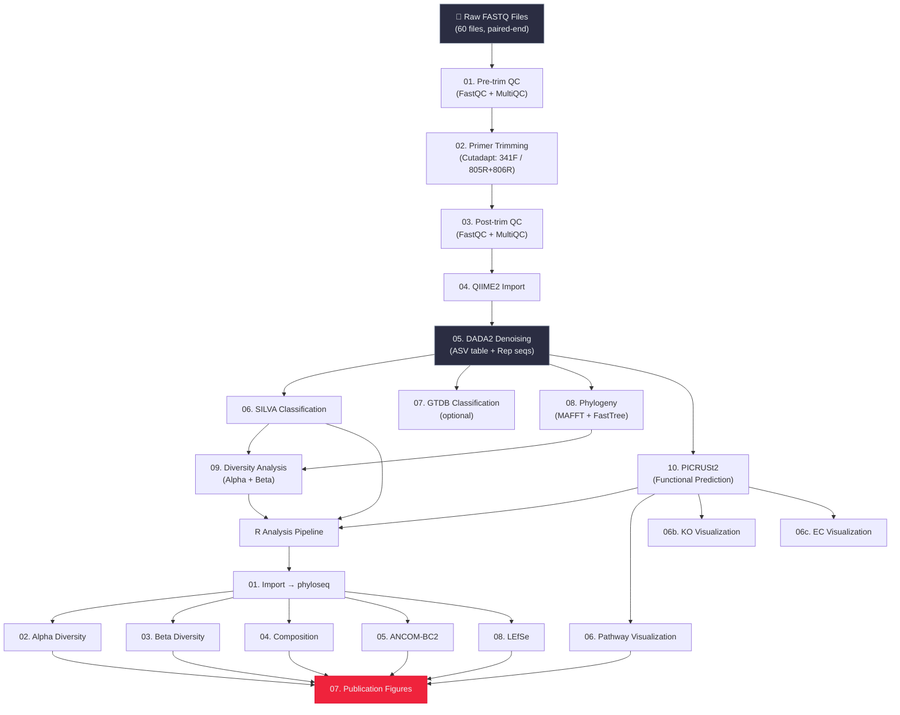

# 🧬 16S rRNA Microbiome Analysis Pipeline

## Bronchoalveolar Lavage Fluid (BALF) Microbiome in Lung Cancer With and Without COPD

[](https://qiime2.org/)
[](https://cran.r-project.org/)
[](https://opensource.org/licenses/MIT)

A comprehensive, reproducible bioinformatics pipeline for 16S rRNA gene sequencing analysis of bronchoalveolar lavage fluid (BALF) microbiome, comparing three clinical groups: **benign lung mass controls**, **lung cancer patients with COPD (LC_COPD)**, and **lung cancer patients without COPD (LC_woCOPD)**.

---

## 📋 Table of Contents

1. [Project Overview](#-project-overview)
2. [Study Design](#-study-design)
3. [Requirements](#-requirements)
4. [Installation & Setup](#-installation--setup)
5. [Directory Structure](#-directory-structure)
6. [Pipeline Workflow](#-pipeline-workflow)
7. [Step-by-Step Execution Guide](#-step-by-step-execution-guide)
8. [R Analysis Scripts](#-r-analysis-scripts)
9. [Key Results Summary](#-key-results-summary)
10. [Output Files](#-output-files)
11. [Parameters & Configuration](#-parameters--configuration)
12. [Reproducing the Analysis](#-reproducing-the-analysis)
13. [Troubleshooting](#-troubleshooting)
14. [Citation](#-citation)
15. [Contact](#-contact)

---

## 🔬 Project Overview

This pipeline performs end-to-end 16S rRNA microbiome analysis from raw Illumina paired-end FASTQ files through to publication-quality figures. The analysis investigates microbial community differences in bronchoalveolar lavage fluid (BALF) among lung cancer patients stratified by COPD comorbidity.

### Analysis Modules

| Module | Tool(s) | Description |
|--------|---------|-------------|
| **Quality Control** | FastQC, MultiQC | Pre- and post-trimming quality assessment |
| **Primer Trimming** | Cutadapt | V3-V4 primer removal (341F / 805R+806R) |
| **Denoising** | DADA2 | Amplicon Sequence Variant (ASV) inference |
| **Taxonomy** | SILVA 138 (primary), GTDB r214 (optional) | Taxonomic classification |
| **Phylogeny** | MAFFT + FastTree | Phylogenetic tree construction |
| **Alpha Diversity** | phyloseq, vegan | Within-sample diversity (8 metrics) |
| **Beta Diversity** | phyloseq, vegan | Between-sample diversity (4 distance metrics + PCoA/NMDS) |
| **Composition** | phyloseq, ggplot2 | Phylum/Genus-level barplots, heatmaps, core microbiome, Venn diagrams |
| **Differential Abundance** | ANCOM-BC2 | Log-fold change analysis with bias correction |
| **LEfSe** | microbiomeMarker | Linear discriminant analysis Effect Size for biomarker discovery |
| **Functional Prediction** | PICRUSt2 | MetaCyc pathways, KO, and EC number predictions |
| **Visualization** | ggplot2, ComplexHeatmap | Publication-quality figures (PDF, PNG, TIFF) |

---

## 🧪 Study Design

### Sample Groups

| Group | Samples | Condition | COPD Status | Sample Type |
|-------|---------|-----------|-------------|-------------|
| **Control** | C1–C10 (n=10) | Healthy | No | BALF |
| **LC_COPD** | LC1–LC10 (n=10) | Lung Cancer | Yes | BALF |
| **LC_woCOPD** | LC11–LC20 (n=10) | Lung Cancer | No | BALF |

### Sequencing Details

- **Platform**: Illumina MiSeq
- **Read type**: Paired-end (2 × 300 bp)
- **Target region**: V3-V4 hypervariable region
- **Forward primer**: 341F (`CCTACGGGNGGCWGCAG`, 17 bp)
- **Reverse primers**: Mixed — 805R (`GACTACHVGGGTATCTAATCC`, 21 bp, ~39% detection) and 806R (`GGACTACHVGGGTWTCTAAT`, 20 bp, ~89% detection)
- **Total raw files**: 60 FASTQ files (30 samples × 2 read directions)

---

## 💻 Requirements

### Hardware

| Resource | Minimum | Recommended |
|----------|---------|-------------|
| CPU | 4 cores | 6+ cores |
| RAM | 8 GB | 11+ GB (with swap enabled) |
| Swap | 8 GB | 16+ GB |
| Storage | 30 GB | 50+ GB free |

> **WSL users:** This pipeline was developed on WSL with **11 GB RAM** and **28 GB swap** allocated. DADA2 denoising and PICRUSt2 are the most memory-intensive steps. If running under WSL, ensure adequate RAM and swap are configured in your `.wslconfig` file:
> ```ini
> # %UserProfile%\.wslconfig
> [wsl2]
> memory=11GB
> swap=28GB
> processors=6
> ```

### Software

- **OS**: Linux or Windows Subsystem for Linux (WSL)
- **Package manager**: Conda or Mamba
- **R**: version 4.3+
- **RStudio** (optional): For interactive R analysis

### Conda Environments

The pipeline uses three separate conda environments to avoid dependency conflicts:

| Environment | Purpose | Key Packages |
|------------|---------|--------------|
| `qiime2-amplicon-2024.10` | QIIME2 processing | QIIME2, DADA2, Cutadapt, FastQC, MultiQC |
| `microbiome-r` | R statistical analysis | R, phyloseq, ANCOMBC, vegan, ggplot2, ComplexHeatmap |
| `picrust2` | Functional prediction | PICRUSt2 |

Environment YAML specs are available in the `envs/` directory.

---

## 🛠 Installation & Setup

### Step 1: Clone the Repository

```bash
git clone https://github.com/<your-username>/LC_COPD_microbiome.git
cd LC_COPD_microbiome
```

### Step 2: Run the Automated Setup Script

```bash
chmod +x scripts/*.sh
bash scripts/00_setup_environment.sh
```

This script will:
- Create the full directory structure (see [Directory Structure](#-directory-structure))
- Set up all three conda environments
- Download the **SILVA 138** classifier (~1 GB)
- Optionally prepare the **GTDB r214** database (requires RESCRIPt training or a pre-trained artifact)

### Step 3: Install Additional R Packages

```bash
conda activate microbiome-r
Rscript scripts/install_r_packages.R
```

This installs Bioconductor and CRAN packages including: `phyloseq`, `ANCOMBC`, `microbiomeMarker`, `ComplexHeatmap`, `tidyverse`, `vegan`, `ape`, `VennDiagram`, and the project's custom plotting theme.

### Step 4: Restore R Package Versions (renv)

This project uses [`renv`](https://rstudio.github.io/renv/) to lock exact R package versions for reproducibility. The `renv.lock` file (included in the repository) records every package and its version. The `renv/` library directory itself is **not included in the repository** because it is generated locally.

To recreate the exact R environment used in this analysis:

```bash
conda activate microbiome-r
cd LC_COPD_microbiome

# 1. Install renv if it is not already available
Rscript --vanilla -e 'install.packages("renv", repos="https://cloud.r-project.org")'

# 2. Restore all package versions recorded in renv.lock
#    This will create a local renv/ folder and install all packages
#    (CRAN + Bioconductor) with the exact versions used in the project
Rscript --vanilla -e 'renv::restore()'
```

> **Note:** The first `renv::restore()` may take **15–30 minutes** because it downloads and installs all dependencies (including Bioconductor packages such as `phyloseq`, `ANCOMBC`, `ComplexHeatmap`, etc.).
>
> All packages are installed into a **project-local library (`renv/library/`)**, leaving your global R environment unchanged.

If `renv::restore()` fails due to missing system libraries, you can fall back to manual installation:

```bash
Rscript scripts/install_r_packages.R
```

### Step 5: Place Raw Data

Copy your raw FASTQ files into the `raw_data/` directory:

```
raw_data/
├── C1_R1.fastq.gz
├── C1_R2.fastq.gz
├── C2_R1.fastq.gz
├── ...
└── LC20_R2.fastq.gz
```

File naming convention: `{SampleID}_R{1|2}.fastq.gz`

---

## 📁 Directory Structure

```
LC_COPD_microbiome/
├── raw_data/                          # Original FASTQ files (read-only, 60 files)
├── scripts/                           # Bash pipeline scripts
│   ├── config.sh                      # Central configuration (paths, parameters)
│   ├── 00_setup_environment.sh        # Environment & directory setup
│   ├── 01_fastqc_pretrim.sh           # Pre-trimming quality check
│   ├── 02_trim_primers.sh             # Cutadapt primer removal
│   ├── 03_fastqc_posttrim.sh          # Post-trimming quality check
│   ├── 04_qiime2_import.sh            # Import FASTQs into QIIME2
│   ├── 05_dada2_denoise.sh            # DADA2 denoising (ASV inference)
│   ├── 06_taxonomy_silva.sh           # SILVA 138 classification
│   ├── 07_taxonomy_gtdb.sh            # GTDB r214 classification (optional)
│   ├── 08_phylogeny.sh                # MAFFT alignment + FastTree
│   ├── 09_diversity.sh                # Alpha & beta diversity (QIIME2)
│   ├── 10_picrust2.sh                 # PICRUSt2 functional prediction
│   ├── install_r_packages.R           # R package installer
│   └── optimize_dada2_params.R        # DADA2 parameter grid-search
├── R_analysis/                        # R analysis scripts
│   ├── 01_import_phyloseq.R           # Import QIIME2 → phyloseq
│   ├── 02_alpha_diversity.R           # Alpha diversity analysis
│   ├── 03_beta_diversity.R            # Beta diversity & ordination
│   ├── 04_composition.R               # Taxonomic composition & core microbiome
│   ├── 05_ancombc2.R                  # ANCOM-BC2 differential abundance
│   ├── 06_picrust_visualization.R     # PICRUSt2 pathway visualization
│   ├── 06b_ko_visualization.R         # KEGG Ortholog (KO) visualization
│   ├── 06c_ec_visualization.R         # Enzyme Commission (EC) visualization
│   ├── 07_publication_plots.R         # Publication-quality composite figures
│   ├── 08_lefse.R                     # LEfSe biomarker analysis
│   ├── 09_metabolite_taxa_correlation_median_imputation.R  # Metabolite–taxa Spearman correlation
│   ├── functions/
│   │   └── plotting_theme.R           # Shared publication plotting theme
│   └── data/                          # Intermediate R data objects (.rds)
├── results/
│   ├── qc_reports/                    # FastQC & MultiQC outputs
│   ├── trimmed_reads/                 # Primer-trimmed sequences
│   ├── qiime2/                        # QIIME2 artifacts (.qza / .qzv)
│   │   ├── imported/                  # Imported sequences
│   │   ├── dada2_output/              # ASV table & rep seqs
│   │   ├── taxonomy_silva/            # SILVA classification
│   │   ├── taxonomy_gtdb/             # GTDB classification
│   │   ├── phylogeny/                 # Phylogenetic tree
│   │   └── diversity/                 # QIIME2 diversity outputs
│   ├── dada2_optimization/            # Parameter grid-search results
│   ├── picrust2/                      # PICRUSt2 output tables
│   │   ├── picrust2_out/              # Full PICRUSt2 output
│   │   ├── pathways_with_descriptions.tsv
│   │   ├── KO_metagenome_with_descriptions.tsv
│   │   └── EC_metagenome_with_descriptions.tsv
│   └── tables/                        # Exported data tables (CSV/TSV)
│       ├── asv_counts.tsv             # Raw ASV count table
│       ├── taxonomy_silva.tsv         # SILVA taxonomy assignments
│       ├── dada2_stats.tsv            # DADA2 processing statistics
│       ├── alpha_diversity_values.csv
│       ├── alpha_diversity_kruskal_wallis.csv
│       ├── beta_diversity_permanova.csv
│       ├── beta_diversity_pairwise_permanova.csv
│       ├── ancombc2_significant.csv
│       ├── composition_phylum.csv / composition_genus.csv
│       ├── core_microbiome.csv
│       ├── pathway_significant.csv / ko_significant.csv / ec_significant.csv
│       ├── pval_filtered/             # P-value filtered ANCOM-BC2 results
│       └── lefse/                     # LEfSe marker tables
├── figures/
│   ├── alpha_diversity/               # Alpha diversity plots
│   ├── beta_diversity/                # PCoA, NMDS ordinations
│   ├── composition/                   # Barplots, heatmaps, Venn diagrams
│   ├── differential_abundance/        # Volcano plots, ANCOM-BC2
│   ├── functional/                    # PICRUSt2 pathway/KO/EC figures
│   ├── lefse/                         # LEfSe LDA bar plots & cladograms
│   ├── qc/                            # Quality control plots
│   └── publication/                   # Final publication-ready figures
├── metadata/
│   ├── sample_metadata.tsv            # Sample metadata (group, disease, COPD, sample type)
│   └── manifest.tsv                   # QIIME2 import manifest
├── databases/
│   ├── silva/                         # SILVA 138-99 classifier
│   └── gtdb/                          # GTDB r214 classifier
├── envs/                              # Conda environment YAML specs
│   ├── qiime2-env.yml
│   ├── r-microbiome-env.yml
│   └── picrust2-env.yml
├── logs/                              # Pipeline execution logs
├── renv.lock                          # Exact R package versions (tracked)
├── .Rprofile                          # Auto-activates renv on R startup
├── renv/                              # (auto-generated, not in repo)
│   ├── activate.R                     # renv bootstrap script (tracked)
│   ├── settings.json                  # renv config (tracked)
│   └── library/                       # Installed packages (auto-generated, not in repo)
├── LC_COPD_microbiome.Rproj           # RStudio project file
└── README.md                          # This file
```

---

## 🔄 Pipeline Workflow


```mermaid
flowchart TD
    A["📁 Raw FASTQ Files<br/>(60 files, paired-end)"] --> B["01. Pre-trim QC<br/>(FastQC + MultiQC)"]
    B --> C["02. Primer Trimming<br/>(Cutadapt: 341F / 805R+806R)"]
    C --> D["03. Post-trim QC<br/>(FastQC + MultiQC)"]
    D --> E["04. QIIME2 Import"]
    E --> F["05. DADA2 Denoising<br/>(ASV table + Rep seqs)"]
    F --> G["06. SILVA Classification"]
    F --> H["07. GTDB Classification<br/>(optional)"]
    F --> I["08. Phylogeny<br/>(MAFFT + FastTree)"]
    G --> J["09. Diversity Analysis<br/>(Alpha + Beta)"]
    I --> J
    F --> K["10. PICRUSt2<br/>(Functional Prediction)"]

    J --> L["R Analysis Pipeline"]
    G --> L
    K --> L

    L --> L1["01. Import → phyloseq"]
    L1 --> L2["02. Alpha Diversity"]
    L1 --> L3["03. Beta Diversity"]
    L1 --> L4["04. Composition"]
    L1 --> L5["05. ANCOM-BC2"]
    L1 --> L8["08. LEfSe"]
    K --> L6["06. Pathway Visualization"]
    K --> L6b["06b. KO Visualization"]
    K --> L6c["06c. EC Visualization"]
    L2 & L3 & L4 & L5 & L6 & L8 --> L7["07. Publication Figures"]

    style A fill:#2b2d42,color:#edf2f4,stroke:#8d99ae
    style F fill:#2b2d42,color:#edf2f4,stroke:#8d99ae
    style L7 fill:#ef233c,color:#edf2f4,stroke:#d90429
```

---

## 🚀 Step-by-Step Execution Guide

> **Note:** All bash scripts should be run from the project root directory. Each script sources `config.sh` for shared parameters.

### Phase 1: Quality Control & Trimming

```bash
cd /path/to/LC_COPD_microbiome

# Step 0: One-time setup (environments, databases, directories)
bash scripts/00_setup_environment.sh

# Step 1: Pre-trimming quality assessment
bash scripts/01_fastqc_pretrim.sh
# Output: results/qc_reports/pretrim_fastqc/ + MultiQC report

# Step 2: Primer trimming with Cutadapt
# Removes 341F and mixed 805R/806R primers
# Both primers are searched for and trimmed simultaneously
bash scripts/02_trim_primers.sh
# Output: results/trimmed_reads/

# Step 3: Post-trimming quality assessment
bash scripts/03_fastqc_posttrim.sh
# Output: results/qc_reports/posttrim_fastqc/ + MultiQC report
```

### Phase 2: QIIME2 Processing

```bash
# Step 4: Import trimmed reads as QIIME2 artifact
bash scripts/04_qiime2_import.sh
# Output: results/qiime2/imported/

# Step 5: DADA2 denoising (~2-4 hours)
# Uses optimized parameters: truncLen F=275, R=220; maxEE F=2, R=4
bash scripts/05_dada2_denoise.sh
# Output: results/qiime2/dada2_output/, results/tables/dada2_stats.tsv

# Step 6: Taxonomy assignment with SILVA 138
bash scripts/06_taxonomy_silva.sh
# Output: results/qiime2/taxonomy_silva/, results/tables/taxonomy_silva.tsv

# Step 7 (Optional): Taxonomy assignment with GTDB r214
bash scripts/07_taxonomy_gtdb.sh
# Output: results/qiime2/taxonomy_gtdb/

# Step 8: Phylogenetic tree construction
bash scripts/08_phylogeny.sh
# Output: results/qiime2/phylogeny/, results/tables/phylogenetic_tree.nwk
```

### Phase 3: Diversity & Functional Analysis

```bash
# Step 9: Alpha and beta diversity (QIIME2)
bash scripts/09_diversity.sh
# Output: results/qiime2/diversity/, results/tables/

# Step 10: PICRUSt2 functional prediction (~1-2 hours)
bash scripts/10_picrust2.sh
# Output: results/picrust2/
```

### Phase 4: R Statistical Analysis

```bash
conda activate microbiome-r
cd R_analysis

# 01. Import QIIME2 artifacts into R phyloseq object
Rscript 01_import_phyloseq.R

# 02. Alpha diversity (Kruskal-Wallis, Wilcoxon, rarefaction curves)
Rscript 02_alpha_diversity.R

# 03. Beta diversity (PERMANOVA, PERMDISP, PCoA, NMDS)
Rscript 03_beta_diversity.R

# 04. Taxonomic composition (barplots, heatmaps, core microbiome, Venn diagrams)
Rscript 04_composition.R

# 05. Differential abundance (ANCOM-BC2 for each group comparison)
Rscript 05_ancombc2.R

# 06a. Functional pathway visualization (MetaCyc pathways)
Rscript 06_picrust_visualization.R

# 06b. KEGG Ortholog (KO) visualization
Rscript 06b_ko_visualization.R

# 06c. Enzyme Commission (EC) number visualization
Rscript 06c_ec_visualization.R

# 07. Generate all publication-quality composite figures
Rscript 07_publication_plots.R

# 08. LEfSe biomarker analysis (requires microbiomeMarker package)
Rscript 08_lefse.R

# 09. Metabolite–taxa Spearman correlation (median imputation)
Rscript 09_metabolite_taxa_correlation_median_imputation.R
```

### One-Command Pipeline (Expert Mode)

```bash
# Run all bash scripts sequentially with logging
cd /path/to/LC_COPD_microbiome
for script in scripts/{01..10}*.sh; do
    echo "Running: $script"
    bash "$script" 2>&1 | tee "logs/$(basename $script .sh).log"
done

# Run all R scripts with logging
conda activate microbiome-r
for script in R_analysis/{01..08}*.R; do
    echo "Running: $script"
    Rscript "$script" 2>&1 | tee "logs/$(basename $script .R).log"
done
```

---

## 📊 R Analysis Scripts

### `01_import_phyloseq.R` — Data Import & Filtering

Imports QIIME2 artifacts (ASV table, taxonomy, phylogenetic tree, metadata) into a **phyloseq** object. Applies filtering to remove low-abundance/prevalence ASVs. Saves both raw and filtered phyloseq objects as `.rds` files.

### `02_alpha_diversity.R` — Alpha Diversity

Computes 8 alpha diversity indices:
- **Observed**, **Chao1**, **ACE** (richness)
- **Shannon**, **Simpson**, **Inverse Simpson**, **Fisher** (evenness/diversity)
- **Pielou's Evenness**

Statistical testing via Kruskal-Wallis (omnibus) and pairwise Wilcoxon rank-sum tests. Generates rarefaction curves to evaluate sequencing depth sufficiency.

### `03_beta_diversity.R` — Beta Diversity

Calculates four distance matrices:
- **Bray-Curtis** (abundance-weighted)
- **Jaccard** (presence/absence)
- **Weighted UniFrac** (phylogenetic + abundance)
- **Unweighted UniFrac** (phylogenetic only)

Statistical testing: PERMANOVA (adonis2, 999 permutations), pairwise PERMANOVA, and PERMDISP (betadisper) for homogeneity of dispersion. Generates PCoA and NMDS ordination plots.

### `04_composition.R` — Taxonomic Composition

Generates phylum- and genus-level stacked barplots (per sample and per group means), a top-30 genus heatmap (ComplexHeatmap), prevalence-abundance scatter, core microbiome analysis (prevalence ≥ 70%, detection threshold ≥ 0.01%), and a Venn diagram of shared/unique core taxa.

### `05_ancombc2.R` — Differential Abundance

Applies ANCOM-BC2 at the genus level with bias correction. Tests LC_COPD vs Control and LC_woCOPD vs Control. Produces volcano plots of log-fold changes with q-value-based significance. Saves both q-value and p-value filtered results.

### `06_picrust_visualization.R` / `06b_ko_visualization.R` / `06c_ec_visualization.R` — Functional Predictions

Visualizes PICRUSt2 predicted functional profiles:
- **MetaCyc pathways** (`06_picrust_visualization.R`)
- **KEGG Orthologs** (`06b_ko_visualization.R`)
- **Enzyme Commission numbers** (`06c_ec_visualization.R`)

Each script generates PCA ordinations, top-30 heatmaps, differential analysis (Kruskal-Wallis), and significant feature barplots. PERMANOVA tests functional community-level differences between groups.

### `07_publication_plots.R` — Publication Figures

Assembles publication-ready composite figures from individual analyses. Outputs in PDF, PNG, and TIFF formats at journal-quality resolution (300 DPI).

### `08_lefse.R` — LEfSe Biomarker Analysis

Runs Linear discriminant analysis Effect Size (LEfSe) using the `microbiomeMarker` R package. Identifies genus-level biomarker taxa distinguishing the three clinical groups. Generates LDA score barplots and cladograms.

### `09_metabolite_taxa_correlation_median_imputation.R` — Metabolite–Taxa Correlation

Computes Spearman rank correlations between ANCOM-BC2 differentially abundant genera (CLR-transformed) and four ¹H-NMR-quantified BALF metabolites (Creatinine, Lactate, Tryptophan, Tyrosine). Missing metabolite values are imputed using per-group medians; metabolite data are then log₂-transformed and z-score normalized. Runs correlations for three comparison subsets (LC_COPD vs Control, LC vs Control, LC_COPD vs LC) plus a focused 5-taxa panel. Generates `pheatmap` heatmaps with significance stars (\* p < 0.05, \*\* p < 0.01, \*\*\* p < 0.001) and saves correlation r-value/p-value matrices as CSV files.

---

## 📈 Key Results Summary

### DADA2 Processing Statistics

| Metric | Value |
|--------|-------|
| Total input reads | 1,395,788 |
| Mean input reads/sample | 46,526 |
| Mean non-chimeric reads/sample | 18,504 |
| Mean retention rate | 39.7% |
| DADA2 parameters | truncLen F=275, R=220; maxEE F=2, R=4 |
| Total ASVs identified | 6,409 (after prevalence filtering) |

> **DADA2 parameter optimization**: A grid-search across 36 parameter combinations (truncLen_F: 260/270/280, truncLen_R: 210/220/230/240, maxEE: (2,2)/(2,3)/(3,2)/(3,3)) was performed. The selected parameters (F=275, R=220, maxEE F=2, R=4) balanced read retention (~40%) with sufficient overlap (≥20 bp) for the ~460 bp V3-V4 amplicon, while using slightly relaxed maxEE for reverse reads to account for their typically lower quality.

#### Per-Sample DADA2 Processing

| Sample | Input | Filtered | % Filtered | Merged | % Merged | Non-chimeric | % Retained |
|--------|-------|----------|-----------|--------|----------|-------------|-----------|
| C1 | 53,911 | 40,707 | 75.5% | 17,828 | 33.1% | 14,749 | 27.4% |
| C2 | 48,355 | 35,965 | 74.4% | 26,469 | 54.7% | 18,081 | 37.4% |
| C3 | 45,837 | 30,778 | 67.2% | 23,815 | 52.0% | 16,178 | 35.3% |
| C4 | 39,542 | 22,507 | 56.9% | 17,048 | 43.1% | 9,175 | 23.2% |
| C5 | 47,946 | 35,284 | 73.6% | 25,823 | 53.9% | 23,402 | 48.8% |
| C6 | 46,571 | 35,009 | 75.2% | 23,659 | 50.8% | 19,847 | 42.6% |
| C7 | 49,314 | 38,113 | 77.3% | 27,656 | 56.1% | 24,259 | 49.2% |
| C8 | 46,931 | 36,149 | 77.0% | 24,982 | 53.2% | 22,872 | 48.7% |
| C9 | 48,483 | 36,579 | 75.5% | 25,468 | 52.5% | 24,096 | 49.7% |
| C10 | 47,928 | 36,297 | 75.7% | 24,927 | 52.0% | 23,101 | 48.2% |
| LC1 | 48,161 | 36,333 | 75.4% | 25,107 | 52.1% | 18,904 | 39.3% |
| LC2 | 46,594 | 36,170 | 77.6% | 27,500 | 59.0% | 21,379 | 45.9% |
| LC3 | 46,248 | 35,333 | 76.4% | 24,070 | 52.1% | 14,068 | 30.4% |
| LC4 | 47,680 | 35,305 | 74.1% | 25,542 | 53.6% | 17,969 | 37.7% |
| LC5 | 41,669 | 22,693 | 54.5% | 15,863 | 38.1% | 14,445 | 34.7% |
| LC6 | 46,164 | 33,120 | 71.7% | 24,983 | 54.1% | 18,465 | 40.0% |
| LC7 | 47,027 | 35,715 | 76.0% | 24,525 | 52.2% | 19,211 | 40.9% |
| LC8 | 47,110 | 35,769 | 75.9% | 25,785 | 54.7% | 20,617 | 43.8% |
| LC9 | 48,256 | 37,377 | 77.5% | 27,785 | 57.6% | 23,744 | 49.2% |
| LC10 | 40,644 | 23,360 | 57.5% | 17,065 | 42.0% | 12,853 | 31.6% |
| LC11 | 44,914 | 29,912 | 66.6% | 20,921 | 46.6% | 15,964 | 35.5% |
| LC12 | 46,633 | 35,636 | 76.4% | 25,608 | 54.9% | 16,539 | 35.5% |
| LC13 | 48,419 | 37,299 | 77.0% | 26,695 | 55.1% | 18,874 | 39.0% |
| LC14 | 48,349 | 37,067 | 76.7% | 28,527 | 59.0% | 21,193 | 43.8% |
| LC15 | 47,402 | 35,972 | 75.9% | 26,027 | 54.9% | 20,739 | 43.8% |
| LC16 | 45,767 | 31,246 | 68.3% | 21,746 | 47.5% | 16,789 | 36.7% |
| LC17 | 41,402 | 23,943 | 57.8% | 17,322 | 41.8% | 15,742 | 38.0% |
| LC18 | 46,278 | 34,053 | 73.6% | 23,571 | 50.9% | 19,778 | 42.7% |
| LC19 | 46,254 | 34,604 | 74.8% | 24,913 | 53.9% | 17,449 | 37.7% |
| LC20 | 45,999 | 34,574 | 75.2% | 23,977 | 52.1% | 18,326 | 39.8% |

---

### 16S rRNA Sequencing Summary

The 16S rRNA gene sequencing (V3-V4 region) was used to assess the changes in the BALF microbiota between the Control, LC_COPD, and LC_woCOPD groups. A total of 1,395,788 high-quality raw reads were generated using the Illumina MiSeq platform. We obtained 558,808 clean reads (19,576.0, 18,165.5, and 18,139.3 average reads for Control, LC_COPD, and LC_woCOPD groups, respectively) after filtering and chimera removal using DADA2. A total of 6,409 ASVs were identified after prevalence filtering. Specifically, taxa were required to be present with counts > 0 in at least 1% of the total samples (in this case, at least 1 sample out of 30) to be retained for downstream analysis. These 6,409 ASVs belonged to 584 different genera in 43 different phyla. Of these ASVs, 227 were shared among the three groups, and 1,796, 1,929, and 1,870 ASVs were specific to the Control, LC_COPD, and LC_woCOPD groups, respectively.

#### Taxonomic Distribution

| Rank | Unique Taxa |
|------|------------|
| Kingdom | 2 |
| Phylum | 43 |
| Class | 107 |
| Order | 227 |
| Family | 352 |
| Genus | 584 |
| Species | 508 |

#### ASV Distribution Across Groups (Venn Diagram)

| Venn Region | ASV Count |
|-------------|-----------|
| Shared (all 3 groups) | 227 |
| Control & LC_COPD only | 298 |
| Control & LC_woCOPD only | 59 |
| LC_COPD & LC_woCOPD only | 230 |
| Unique to Control | 1,796 |
| Unique to LC_COPD | 1,929 |
| Unique to LC_woCOPD | 1,870 |
| **Total** | **6,409** |

> **Figure**: `figures/composition/asv_venn_diagram.png`

### Sample Summary

| Group | N | Mean Reads | SD | Min Reads | Max Reads | Mean ASVs | SD |
|-------|---|-----------|-----|-----------|-----------|-----------|-----|
| Control | 10 | 18,872 | 4,753 | 9,160 | 24,150 | 321 | 167 |
| LC_COPD | 10 | 17,466 | 3,647 | 12,617 | 23,536 | 364 | 143 |
| LC_woCOPD | 10 | 17,175 | 3,123 | 10,217 | 20,891 | 360 | 143 |

---

### Alpha Diversity

All alpha diversity metrics (8 total) showed **no statistically significant differences** (BH-adjusted p > 0.05) across the three groups by Kruskal-Wallis test:

| Metric | Category | H statistic | df | p-value | Adjusted p | Significance |
|--------|----------|-------------|-----|---------|------------|--------------|
| Observed | Richness | 0.903 | 2 | 0.637 | 0.651 | ns |
| Chao1 | Richness | 0.859 | 2 | 0.651 | 0.651 | ns |
| ACE | Richness | 0.947 | 2 | 0.623 | 0.651 | ns |
| Shannon | Diversity | 3.440 | 2 | 0.179 | 0.579 | ns |
| Simpson | Diversity | 2.480 | 2 | 0.289 | 0.579 | ns |
| InvSimpson | Diversity | 2.480 | 2 | 0.289 | 0.579 | ns |
| Fisher | Diversity | 1.025 | 2 | 0.599 | 0.651 | ns |
| Pielou | Evenness | 2.766 | 2 | 0.251 | 0.579 | ns |

> **Interpretation**: Similar species richness and evenness across groups suggests that overall community diversity is not globally altered in lung cancer patients. However, compositional differences may exist at the individual taxon or functional level (see below).
>
> **Figures**: `figures/alpha_diversity/alpha_diversity_main.png`, `figures/alpha_diversity/rarefaction_curves.png`

---

### Beta Diversity

#### PERMANOVA (Overall – `adonis2`, 999 permutations)

Community composition differed significantly between groups for multiple distance metrics:

| Distance Metric | Df | Sum of Squares | R² | F | p-value | BH-adj. p | Significant? |
|-----------------|-----|---------------|-----|---|---------|-----------|-------------|
| **Bray-Curtis** | 2 | 0.742 | 0.132 | 2.050 | 0.021 | **0.042** | ✅ Yes |
| **Jaccard** | 2 | 1.128 | 0.089 | 1.319 | 0.001 | **0.004** | ✅ Yes |
| Weighted UniFrac | 2 | 0.125 | 0.141 | 2.214 | 0.058 | 0.058 | ❌ No (marginal) |
| **Unweighted UniFrac** | 2 | 0.684 | 0.083 | 1.225 | 0.032 | **0.043** | ✅ Yes |

> **Interpretation**: Community composition differs significantly by Bray-Curtis (abundance-weighted), Jaccard (presence/absence), and Unweighted UniFrac (phylogeny-aware presence/absence). Weighted UniFrac is borderline (p = 0.058), suggesting the dominant phylogenetic lineages are relatively conserved across groups. Effect sizes (R² = 8–14%) are modest but typical for human microbiome studies with small sample sizes.

#### PERMDISP (Beta Dispersion – `betadisper` + `permutest`, 999 permutations)

| Distance Metric | F | p-value | Significant? |
|-----------------|---|---------|-------------|
| Bray-Curtis | 0.172 | 0.857 | ❌ No |
| Jaccard | 1.044 | 0.366 | ❌ No |
| Weighted UniFrac | 1.840 | 0.187 | ❌ No |
| Unweighted UniFrac | 0.089 | 0.922 | ❌ No |

> **Interpretation**: All PERMDISP tests are non-significant (all p > 0.18), confirming that within-group dispersions are homogeneous across all three groups. This validates that the significant PERMANOVA results reflect genuine differences in community centroids (compositional location), not artifacts of unequal group heterogeneity.

#### Pairwise PERMANOVA (All Distance Metrics)

| Comparison | Distance | R² | F | Raw p | BH-adj. p | Sig? |
|------------|----------|-----|---|-------|-----------|------|
| Control vs LC_COPD | Bray-Curtis | 0.081 | 1.580 | 0.122 | 0.122 | ❌ |
| **Control vs LC_woCOPD** | **Bray-Curtis** | **0.126** | **2.588** | **0.021** | **0.045** | ✅ |
| **LC_COPD vs LC_woCOPD** | **Bray-Curtis** | **0.100** | **2.008** | **0.030** | **0.045** | ✅ |
| Control vs LC_COPD | Jaccard | 0.058 | 1.112 | 0.135 | 0.135 | ❌ |
| **Control vs LC_woCOPD** | **Jaccard** | **0.077** | **1.507** | **0.002** | **0.005** | ✅ |
| **LC_COPD vs LC_woCOPD** | **Jaccard** | **0.069** | **1.344** | **0.003** | **0.005** | ✅ |
| Control vs LC_COPD | Weighted UniFrac | 0.100 | 1.999 | 0.097 | 0.146 | ❌ |
| Control vs LC_woCOPD | Weighted UniFrac | 0.133 | 2.750 | 0.054 | 0.146 | ❌ |
| LC_COPD vs LC_woCOPD | Weighted UniFrac | 0.089 | 1.761 | 0.151 | 0.151 | ❌ |
| Control vs LC_COPD | Unweighted UniFrac | 0.060 | 1.154 | 0.166 | 0.249 | ❌ |
| **Control vs LC_woCOPD** | **Unweighted UniFrac** | **0.074** | **1.440** | **0.015** | **0.045** | ✅ |
| LC_COPD vs LC_woCOPD | Unweighted UniFrac | 0.057 | 1.083 | 0.252 | 0.252 | ❌ |

> **Key finding**: The **LC_woCOPD (lung cancer without COPD)** group is consistently the most compositionally distinct, separating significantly from both Control and LC_COPD by Bray-Curtis and Jaccard, and from Control by Unweighted UniFrac. The Control vs LC_COPD comparison is never significant after correction, meaning the COPD-comorbid lung cancer group resembles healthy controls more than the LC-only group. Weighted UniFrac shows no significant pairwise differences, reinforcing that dominant phylogenetic lineages are conserved.

#### NMDS Ordination

- **Method**: Non-Metric Multidimensional Scaling on Bray-Curtis distances
- **Stress value**: 0.154 (adequate, < 0.2)
- **Convergence**: Best solution found and repeated after 39 iterations (trymax = 100)

> **Figures**: `figures/beta_diversity/beta_diversity_pcoa_combined.png`, `figures/beta_diversity/nmds_bray_curtis.png`, `figures/beta_diversity/distance_comparison_boxplot.pdf`

---

### Differential Abundance (ANCOM-BC2)

ANCOM-BC2 was applied at the genus level (55 genera tested after prevalence/abundance filtering from 177 genera input) with bias correction. Reference group: Control.

#### Significant Taxa (q-value < 0.05)

Three genera passed strict FDR correction (q < 0.05):

| Genus | Phylum | Family | LC_COPD vs Control (LFC ± SE) | q-value | LC_woCOPD vs Control (LFC ± SE) | q-value |
|-------|--------|--------|-------------------------------|---------|--------------------------------|---------|
| ***Neisseria*** | Proteobacteria | Neisseriaceae | **↑ 2.76 ± 0.59** | **0.007** | ↑ 1.28 ± 0.65 | 0.236 |
| ***Cetobacterium*** | Fusobacteriota | Fusobacteriaceae | ↑ 1.71 ± 0.46 | 0.055 | **↑ 1.92 ± 0.43** | **0.027** |
| ***Gemella*** | Firmicutes | Gemellaceae | ↑ 1.08 ± 0.44 | 0.235 | **↑ 1.82 ± 0.48** | **0.035** |

#### LC_COPD vs Control — Differentially Abundant Taxa (p < 0.05)

**32 taxa** were differentially abundant by raw p-value between LC_COPD and Control:

| Genus | Phylum | Family | LFC | SE | p-value | Direction |
|-------|--------|--------|-----|-----|---------|-----------|
| *Cetobacterium* | Fusobacteriota | Fusobacteriaceae | 2.025 | 0.332 | **< 0.001** | ↑ LC_COPD |
| *Capnocytophaga* | Bacteroidota | Flavobacteriaceae | 1.783 | 0.382 | **< 0.001** | ↑ LC_COPD |
| *Parvimonas* | Firmicutes | Peptostreptococcales-Tissierellales | −1.913 | 0.330 | **< 0.001** | ↓ LC_COPD |
| Unclassified (Firmicutes) | Firmicutes | — | −1.597 | 0.309 | **< 0.001** | ↓ LC_COPD |
| *Gemella* | Firmicutes | Gemellaceae | 1.669 | 0.383 | **0.001** | ↑ LC_COPD |
| *Bacteroides* | Bacteroidota | Bacteroidaceae | 1.204 | 0.330 | **0.003** | ↑ LC_COPD |
| *Neisseria* | Proteobacteria | Neisseriaceae | 2.456 | 0.729 | **0.004** | ↑ LC_COPD |
| Unclassified (Actinobacteriota) | Actinobacteriota | — | 1.315 | 0.310 | **0.004** | ↑ LC_COPD |
| Unclassified Eubacteriaceae | Firmicutes | Eubacteriaceae | 1.242 | 0.365 | **0.006** | ↑ LC_COPD |
| Unclassified Erysipelotrichaceae | Firmicutes | Erysipelotrichaceae | 1.260 | 0.363 | **0.006** | ↑ LC_COPD |
| *Peptostreptococcus* | Firmicutes | Peptostreptococcaceae | 1.164 | 0.329 | **0.006** | ↑ LC_COPD |
| *Rothia* | Actinobacteriota | Micrococcaceae | 1.734 | 0.545 | **0.007** | ↑ LC_COPD |
| *Enterococcus* | Firmicutes | Enterococcaceae | 1.488 | 0.290 | **0.007** | ↑ LC_COPD |
| *Catonella* | Firmicutes | Lachnospiraceae | −1.020 | 0.271 | **0.007** | ↓ LC_COPD |
| *Streptococcus* | Firmicutes | Streptococcaceae | 1.855 | 0.651 | **0.011** | ↑ LC_COPD |
| *SBR1031* | Chloroflexi | SBR1031 | −0.778 | 0.245 | **0.013** | ↓ LC_COPD |
| *Leptotrichia* | Fusobacteriota | Leptotrichiaceae | 1.260 | 0.453 | **0.015** | ↑ LC_COPD |
| *Deinococcus* | Deinococcota | Deinococcaceae | −0.966 | 0.272 | **0.016** | ↓ LC_COPD |
| uncultured (Atopobiaceae) | Actinobacteriota | Atopobiaceae | 0.886 | 0.225 | **0.017** | ↑ LC_COPD |
| *Sphaerochaeta* | Spirochaetota | Spirochaetaceae | 1.076 | 0.275 | **0.017** | ↑ LC_COPD |
| Unclassified Micrococcaceae | Actinobacteriota | Micrococcaceae | 0.847 | 0.283 | **0.020** | ↑ LC_COPD |
| *Clostridium sensu stricto 1* | Firmicutes | Clostridiaceae | 1.440 | 0.568 | **0.023** | ↑ LC_COPD |
| Unclassified Bacillaceae | Firmicutes | Bacillaceae | 1.075 | 0.383 | **0.023** | ↑ LC_COPD |
| *OM190* | Planctomycetota | OM190 | 0.706 | 0.234 | **0.023** | ↑ LC_COPD |
| *Abiotrophia* | Firmicutes | Aerococcaceae | 0.798 | 0.254 | **0.026** | ↑ LC_COPD |
| Unclassified Peptostreptococcales-Tissierellales | Firmicutes | Peptostreptococcales-Tissierellales | 0.994 | 0.366 | **0.035** | ↑ LC_COPD |
| *Candidatus Udaeobacter* | Verrucomicrobiota | Chthoniobacteraceae | 0.678 | 0.238 | **0.036** | ↑ LC_COPD |
| *DSSD61* | Proteobacteria | Nitrosomonadaceae | 0.852 | 0.375 | **0.037** | ↑ LC_COPD |
| Unclassified (Actinobacteriota) | Actinobacteriota | — | 0.717 | 0.240 | **0.040** | ↑ LC_COPD |
| uncultured (Prevotellaceae) | Bacteroidota | Prevotellaceae | 0.888 | 0.304 | **0.043** | ↑ LC_COPD |
| *Rikenellaceae RC9 gut group* | Bacteroidota | Rikenellaceae | −0.683 | 0.309 | **0.043** | ↓ LC_COPD |
| *Actinomyces* | Actinobacteriota | Actinomycetaceae | 1.145 | 0.532 | **0.049** | ↑ LC_COPD |

**Summary**: 25 taxa ↑ and 7 taxa ↓ in LC_COPD relative to Control. Enriched genera include oral-associated taxa (*Streptococcus*, *Neisseria*, *Gemella*, *Rothia*, *Capnocytophaga*, *Peptostreptococcus*).

#### LC_woCOPD vs Control — Differentially Abundant Taxa (p < 0.05)

**28 taxa** were differentially abundant by raw p-value between LC_woCOPD and Control:

| Genus | Phylum | Family | LFC | SE | p-value | Direction |
|-------|--------|--------|-----|-----|---------|-----------|
| *Gemella* | Firmicutes | Gemellaceae | 1.949 | 0.426 | **< 0.001** | ↑ LC_woCOPD |
| Unclassified Erysipelotrichaceae | Firmicutes | Erysipelotrichaceae | 1.555 | 0.275 | **< 0.001** | ↑ LC_woCOPD |
| *Rikenellaceae RC9 gut group* | Bacteroidota | Rikenellaceae | −1.360 | 0.324 | **0.001** | ↓ LC_woCOPD |
| *Alcaligenes* | Proteobacteria | Alcaligenaceae | −1.184 | 0.253 | **0.002** | ↓ LC_woCOPD |
| Unclassified (Firmicutes) | Firmicutes | — | −1.472 | 0.344 | **0.003** | ↓ LC_woCOPD |
| *Proteus* | Proteobacteria | Morganellaceae | −1.081 | 0.256 | **0.004** | ↓ LC_woCOPD |
| *Candidatus Saccharimonas* | Patescibacteria | Saccharimonadaceae | −1.319 | 0.273 | **0.005** | ↓ LC_woCOPD |
| Unclassified Lachnospiraceae | Firmicutes | Lachnospiraceae | −1.161 | 0.347 | **0.005** | ↓ LC_woCOPD |
| *Deinococcus* | Deinococcota | Deinococcaceae | −1.087 | 0.240 | **0.006** | ↓ LC_woCOPD |
| *Methylobacterium-Methylorubrum* | Proteobacteria | Beijerinckiaceae | −1.000 | 0.263 | **0.007** | ↓ LC_woCOPD |
| *Enhydrobacter* | Proteobacteria | Moraxellaceae | −0.919 | 0.232 | **0.007** | ↓ LC_woCOPD |
| *Clostridia UCG-014* | Firmicutes | Clostridia UCG-014 | −1.140 | 0.292 | **0.008** | ↓ LC_woCOPD |
| *Enterococcus* | Firmicutes | Enterococcaceae | 1.110 | 0.308 | **0.009** | ↑ LC_woCOPD |
| *Streptococcus* | Firmicutes | Streptococcaceae | 1.473 | 0.522 | **0.011** | ↑ LC_woCOPD |
| *Pedomicrobium* | Proteobacteria | Hyphomicrobiaceae | −0.761 | 0.246 | **0.013** | ↓ LC_woCOPD |
| uncultured (Caulobacteraceae) | Proteobacteria | Caulobacteraceae | −0.837 | 0.308 | **0.015** | ↓ LC_woCOPD |
| *UCG-005* | Firmicutes | Oscillospiraceae | −0.727 | 0.235 | **0.017** | ↓ LC_woCOPD |
| *Haemophilus* | Proteobacteria | Pasteurellaceae | 1.416 | 0.476 | **0.018** | ↑ LC_woCOPD |
| *Alloprevotella* | Bacteroidota | Prevotellaceae | 1.695 | 0.660 | **0.019** | ↑ LC_woCOPD |
| *Cetobacterium* | Fusobacteriota | Fusobacteriaceae | 1.346 | 0.465 | **0.020** | ↑ LC_woCOPD |
| Unclassified (Firmicutes) | Firmicutes | — | 0.836 | 0.283 | **0.021** | ↑ LC_woCOPD |
| *Solobacterium* | Firmicutes | Erysipelotrichaceae | −0.664 | 0.248 | **0.022** | ↓ LC_woCOPD |
| *Slackia* | Actinobacteriota | Eggerthellaceae | −0.709 | 0.248 | **0.024** | ↓ LC_woCOPD |
| *Allobaculum* | Firmicutes | Erysipelotrichaceae | −0.823 | 0.236 | **0.025** | ↓ LC_woCOPD |
| *RF39* | Firmicutes | RF39 | −0.813 | 0.241 | **0.028** | ↓ LC_woCOPD |
| *Fimbriimonadaceae* | Armatimonadota | Fimbriimonadaceae | −0.626 | 0.250 | **0.037** | ↓ LC_woCOPD |
| *[Ruminococcus] gauvreauii group* | Firmicutes | Lachnospiraceae | −0.582 | 0.242 | **0.040** | ↓ LC_woCOPD |
| *Vicinamibacteraceae* | Acidobacteriota | Vicinamibacteraceae | −0.587 | 0.246 | **0.049** | ↓ LC_woCOPD |

**Summary**: 8 taxa ↑ and 20 taxa ↓ in LC_woCOPD relative to Control. The LC_woCOPD group shows predominantly decreased taxa, with notable depletion of environmentally-associated genera (*Deinococcus*, *Methylobacterium-Methylorubrum*, *Pedomicrobium*) and enrichment of oral/respiratory-associated genera (*Gemella*, *Streptococcus*, *Haemophilus*, *Alloprevotella*).

#### LC_COPD vs LC_woCOPD — Differentially Abundant Taxa (p < 0.05)

**17 taxa** were differentially abundant by raw p-value between LC_COPD and LC_woCOPD:

| Genus | Phylum | Family | LFC | SE | p-value | Direction |
|-------|--------|--------|-----|-----|---------|-----------|
| *Parvimonas* | Firmicutes | Peptostreptococcales-Tissierellales | −2.460 | 0.398 | **< 0.001** | ↓ LC_COPD |
| *Sphingomonas* | Proteobacteria | Sphingomonadaceae | −1.372 | 0.279 | **0.003** | ↓ LC_COPD |
| *Corynebacterium* | Actinobacteriota | Corynebacteriaceae | −1.954 | 0.617 | **0.005** | ↓ LC_COPD |
| *Capnocytophaga* | Bacteroidota | Flavobacteriaceae | 1.481 | 0.451 | **0.006** | ↑ LC_COPD |
| *Clostridium sensu stricto 1* | Firmicutes | Clostridiaceae | 1.653 | 0.498 | **0.007** | ↑ LC_COPD |
| Unclassified (Firmicutes) | Firmicutes | — | −0.972 | 0.294 | **0.008** | ↓ LC_COPD |
| *Granulicatella* | Firmicutes | Carnobacteriaceae | −0.912 | 0.305 | **0.009** | ↓ LC_COPD |
| *Actinobacillus* | Proteobacteria | Pasteurellaceae | −0.822 | 0.278 | **0.013** | ↓ LC_COPD |
| Unclassified Peptostreptococcales-Tissierellales | Firmicutes | Peptostreptococcales-Tissierellales | 1.374 | 0.407 | **0.015** | ↑ LC_COPD |
| *Allobaculum* | Firmicutes | Erysipelotrichaceae | 1.003 | 0.250 | **0.016** | ↑ LC_COPD |
| *Christensenellaceae R-7 group* | Firmicutes | Christensenellaceae | −0.652 | 0.230 | **0.020** | ↓ LC_COPD |
| *SBR1031* | Chloroflexi | SBR1031 | −0.658 | 0.204 | **0.023** | ↓ LC_COPD |
| Unclassified Lachnospiraceae | Firmicutes | Lachnospiraceae | 0.795 | 0.314 | **0.026** | ↑ LC_COPD |
| *Haemophilus* | Proteobacteria | Pasteurellaceae | −1.138 | 0.447 | **0.032** | ↓ LC_COPD |
| Unclassified Micrococcaceae | Actinobacteriota | Micrococcaceae | 0.769 | 0.277 | **0.032** | ↑ LC_COPD |
| Unclassified Selenomonadaceae | Firmicutes | Selenomonadaceae | −0.705 | 0.303 | **0.035** | ↓ LC_COPD |
| *Alloprevotella* | Bacteroidota | Prevotellaceae | −1.429 | 0.632 | **0.036** | ↓ LC_COPD |

**Summary**: 6 taxa ↑ and 11 taxa ↓ in LC_COPD relative to LC_woCOPD. Key differences include *Corynebacterium* (↓ in COPD), *Capnocytophaga* (↑ in COPD), *Haemophilus* and *Alloprevotella* (↓ in COPD, ↑ in LC_woCOPD), and *Clostridium sensu stricto 1* (↑ in COPD).

> **Figures**: `figures/differential_abundance/pval_filtered/volcano_plots_combined.png`, `figures/differential_abundance/pval_filtered/lfc_barplots_combined.png`, `figures/differential_abundance/pval_filtered/heatmap_significant_taxa.pdf`, `figures/differential_abundance/qval_filtered/volcano_plots_combined.png`, `figures/differential_abundance/qval_filtered/lfc_barplots_combined.png`

---

### LEfSe Biomarker Analysis

Linear discriminant analysis Effect Size (LEfSe) identified genus-level biomarkers distinguishing the three clinical groups (LDA score > 2.0, p < 0.05). A total of **71 significant biomarkers** were identified across three pairwise comparisons.

#### LC_COPD vs Control (25 biomarkers)

**Higher in LC_COPD (16 taxa):**

| Genus | Phylum | LDA Score | p-value |
|-------|--------|-----------|---------|
| *Streptococcus* | Firmicutes | 4.97 | 0.019 |
| *Neisseria* | Proteobacteria | 4.64 | 0.010 |
| *Cetobacterium* | Fusobacteriota | 4.06 | 0.001 |
| *Gemella* | Firmicutes | 3.62 | 0.007 |
| *Capnocytophaga* | Bacteroidota | 3.31 | 0.005 |
| *Peptostreptococcus* | Firmicutes | 3.27 | 0.022 |
| *Aggregatibacter* | Proteobacteria | 3.22 | 0.031 |
| *Anaerobacillus* | Firmicutes | 3.08 | 0.013 |
| *Bacteroides* | Bacteroidota | 3.01 | 0.017 |
| *ZOR0006* | Firmicutes | 2.84 | 0.008 |
| *Desulfobulbus* | Desulfobacterota | 2.61 | 0.017 |
| *Dongia* | Proteobacteria | 2.04 | 0.041 |
| *Oleiagrimonas* | Proteobacteria | 2.03 | 0.031 |

**Higher in Control (9 taxa):**

| Genus | Phylum | LDA Score | p-value |
|-------|--------|-----------|---------|
| *Turicibacter* | Firmicutes | 2.58 | 0.026 |
| *Brevundimonas* | Proteobacteria | 2.54 | 0.024 |
| *Candidatus Saccharimonas* | Patescibacteria | 2.47 | 0.031 |
| *[Eubacterium] coprostanoligenes group* | Firmicutes | 2.14 | 0.013 |

#### LC_woCOPD vs Control (26 biomarkers)

**Higher in LC_woCOPD/LC (13 taxa):**

| Genus | Phylum | LDA Score | p-value |
|-------|--------|-----------|---------|
| *Alloprevotella* | Bacteroidota | 4.80 | 0.034 |
| *Streptococcus* | Firmicutes | 4.55 | 0.041 |
| *Corynebacterium* | Actinobacteriota | 4.01 | 0.016 |
| *Cetobacterium* | Fusobacteriota | 3.95 | 0.026 |
| *Gemella* | Firmicutes | 3.82 | < 0.001 |
| *Granulicatella* | Firmicutes | 3.41 | 0.004 |
| *Dolosigranulum* | Firmicutes | 3.29 | 0.005 |
| *Aggregatibacter* | Proteobacteria | 3.28 | 0.013 |
| *Streptobacillus* | Fusobacteriota | 3.19 | 0.005 |

**Higher in Control (13 taxa):**

| Genus | Phylum | LDA Score | p-value |
|-------|--------|-----------|---------|
| *Rikenellaceae RC9 gut group* | Bacteroidota | 2.88 | 0.006 |
| *Proteus* | Proteobacteria | 2.60 | 0.047 |
| *Solobacterium* | Firmicutes | 2.44 | 0.020 |
| *Desulfovibrio* | Desulfobacterota | 2.14 | 0.025 |
| *Mycobacterium* | Actinobacteriota | 2.11 | 0.036 |

#### LC_COPD vs LC_woCOPD (20 biomarkers)

**Higher in LC_COPD (11 taxa):**

| Genus | Phylum | LDA Score | p-value |
|-------|--------|-----------|---------|
| *Clostridium sensu stricto 1* | Firmicutes | 4.13 | 0.031 |
| *Capnocytophaga* | Bacteroidota | 3.23 | 0.018 |
| *Rummeliibacillus* | Firmicutes | 3.21 | 0.013 |
| *Anaerobacillus* | Firmicutes | 3.03 | 0.036 |
| *Desulfovibrio* | Desulfobacterota | 2.54 | 0.025 |
| *Abiotrophia* | Firmicutes | 2.46 | 0.031 |

**Higher in LC_woCOPD (9 taxa):**

| Genus | Phylum | LDA Score | p-value |
|-------|--------|-----------|---------|
| *Corynebacterium* | Actinobacteriota | 4.04 | 0.049 |
| *Actinobacillus* | Proteobacteria | 3.64 | 0.031 |
| *Granulicatella* | Firmicutes | 3.39 | 0.026 |
| *Dolosigranulum* | Firmicutes | 3.32 | 0.013 |
| *Streptobacillus* | Fusobacteriota | 3.23 | 0.005 |

> **Figure**: `figures/lefse/combined/lefse_combined_lda_barplots.png`

---

### Core Microbiome

#### Core Taxa at ≥50% Prevalence (>0.1% abundance)

A total of **31 core ASVs** were identified across all samples at 50% prevalence threshold. The number of core taxa per group:

| Group | Core Taxa Count |
|-------|----------------|
| Control | 21 |
| LC_COPD | 31 |
| LC_woCOPD | 37 |

Key core genera include: *Prevotella* (3 ASVs), *Veillonella* (3 ASVs), *Streptococcus* (3 ASVs), *Bacillus* (2 ASVs), *Dickeya* (6 ASVs), *Collinsella* (2 ASVs), *Alloprevotella*, *Actinomyces*, *Cutibacterium*, and *Aerococcus*.

#### Core Taxa at ≥80% Prevalence (>0.1% abundance)

Only **6 highly conserved core ASVs** were present at 80% prevalence:

| Core Taxon | Phylum | Family | Genus |
|-----------|--------|--------|-------|
| ASV 1 | Firmicutes | Veillonellaceae | *Veillonella* |
| ASV 2 | Firmicutes | Streptococcaceae | *Streptococcus* |
| ASV 3 | Firmicutes | Bacillaceae | *Bacillus* |
| ASV 4 | Firmicutes | Bacillaceae | *Bacillus* |
| ASV 5 | Proteobacteria | Enterobacterales (unclassified) | — |
| ASV 6 | Proteobacteria | Enterobacterales (unclassified) | — |

The core taxa per group at 80%: Control = 3, LC_COPD = 7, LC_woCOPD = 11.

> **Figures**: `figures/composition/core_microbiome_venn_50pct.png`, `figures/composition/core_microbiome_venn_80pct.png`

---

### Metabolite–Microbiome Correlation Analysis

Spearman rank correlations were computed between ANCOM-BC2 differentially abundant taxa (CLR-transformed abundances) and four ¹H-NMR-quantified BALF metabolites: **Creatinine** (δ 3.04 ppm), **Lactate** (δ 1.33 ppm), **Tryptophan** (δ 4.03 ppm), and **Tyrosine** (δ 7.12 ppm). Analysis was performed using [`09_metabolite_taxa_correlation_median_imputation.R`](file:///d:/LC_COPD_microbiome/R_analysis/09_metabolite_taxa_correlation_median_imputation.R).

**Methodology:**
- **Taxonomic data**: CLR-transformed genus-level abundances (compositions package, pseudocount 1×10⁻⁶)
- **Metabolite data**: Log₂-transformed and z-score normalized after group-wise median imputation
- **Missing value handling**: Group-wise median imputation (robust to outliers in skewed metabolomics distributions)
- **Statistical test**: Spearman rank correlation (`cor.test`, exact = FALSE); minimum 4 complete pairs required
- **Significance thresholds**: \* p < 0.05, \*\* p < 0.01, \*\*\* p < 0.001

#### Pre-Imputation Missingness Summary

| Metabolite | LC_COPD (n=34) | LC (n=32) | Control (n=25) | Overall (n=91) |
|------------|---------------|-----------|----------------|----------------|
| Creatinine (δ 3.04) | 4 / 34 (11.8%) | 22 / 32 (68.8%) | 12 / 25 (48.0%) | 38 / 91 (41.8%) |
| Lactate (δ 1.33) | 19 / 34 (55.9%) | 18 / 32 (56.2%) | 5 / 25 (20.0%) | 42 / 91 (46.2%) |
| Tryptophan (δ 4.03) | 3 / 34 (8.8%) | 18 / 32 (56.2%) | 5 / 25 (20.0%) | 26 / 91 (28.6%) |
| Tyrosine (δ 7.12) | 25 / 34 (73.5%) | 20 / 32 (62.5%) | 10 / 25 (40.0%) | 55 / 91 (60.4%) |

> **Note**: Missingness reflects the NMR metabolomics dataset structure (multiple biological replicates per clinical subject). Group-wise median imputation was selected over mean imputation to minimize bias from outliers in skewed metabolomics distributions.

#### LC_COPD vs Control — Spearman Correlation (ρ / p-value)

Correlations between 32 differentially abundant taxa and 4 metabolites (n = 20 samples):

| Taxon | Creatinine (ρ) | p-value | Lactate (ρ) | p-value | Tryptophan (ρ) | p-value | Tyrosine (ρ) | p-value |
|-------|---------------|---------|-------------|---------|----------------|---------|--------------|---------|
| *Cetobacterium* | **0.618** | **0.004** | −0.350 | 0.131 | **−0.609** | **0.004** | **0.509** | **0.022** |
| *Peptostreptococcus* | **0.497** | **0.026** | 0.185 | 0.434 | −0.342 | 0.140 | **0.592** | **0.006** |
| *Neisseria* | **0.493** | **0.027** | 0.035 | 0.882 | **−0.475** | **0.034** | **0.504** | **0.024** |
| *Streptococcus* | **0.445** | **0.049** | 0.037 | 0.877 | **−0.457** | **0.043** | **0.578** | **0.008** |
| *Rothia* | 0.403 | 0.078 | 0.104 | 0.663 | −0.375 | 0.104 | **0.499** | **0.025** |
| *Capnocytophaga* | 0.386 | 0.093 | −0.132 | 0.579 | −0.353 | 0.127 | **0.481** | **0.032** |
| Unclassified Erysipelotrichaceae | 0.371 | 0.108 | −0.265 | 0.259 | **−0.474** | **0.035** | 0.373 | 0.106 |
| Unclassified Bacillaceae | 0.345 | 0.136 | −0.350 | 0.131 | −0.379 | 0.099 | 0.232 | 0.324 |
| *Actinomyces* | 0.321 | 0.168 | 0.090 | 0.706 | −0.326 | 0.161 | 0.413 | 0.071 |
| *Gemella* | 0.297 | 0.203 | −0.224 | 0.342 | −0.392 | 0.087 | 0.103 | 0.666 |
| *Bacteroides* | 0.199 | 0.399 | −0.182 | 0.442 | **−0.662** | **0.001** | 0.219 | 0.354 |
| *Clostridium sensu stricto 1* | 0.221 | 0.349 | 0.015 | 0.951 | −0.133 | 0.575 | −0.054 | 0.820 |
| *Catonella* | 0.047 | 0.843 | −0.105 | 0.659 | **−0.526** | **0.017** | −0.001 | 0.997 |
| *Leptotrichia* | 0.078 | 0.744 | −0.227 | 0.336 | −0.428 | 0.060 | 0.188 | 0.428 |
| *SBR1031* | −0.412 | 0.071 | 0.201 | 0.395 | 0.253 | 0.283 | −0.428 | 0.060 |
| *Rikenellaceae RC9 gut group* | **−0.550** | **0.012** | 0.135 | 0.570 | **0.484** | **0.031** | −0.378 | 0.101 |
| *Deinococcus* | −0.159 | 0.503 | 0.342 | 0.140 | 0.421 | 0.065 | 0.173 | 0.465 |
| uncultured (Prevotellaceae) | 0.188 | 0.427 | 0.051 | 0.832 | 0.061 | 0.799 | 0.104 | 0.663 |
| uncultured (Atopobiaceae) | 0.121 | 0.610 | **0.457** | **0.043** | 0.061 | 0.797 | 0.068 | 0.776 |
| *Abiotrophia* | 0.146 | 0.540 | 0.370 | 0.109 | 0.139 | 0.560 | 0.299 | 0.200 |
| *Enterococcus* | −0.059 | 0.806 | 0.327 | 0.159 | 0.163 | 0.492 | 0.095 | 0.690 |
| *Parvimonas* | −0.166 | 0.485 | −0.042 | 0.860 | −0.110 | 0.644 | 0.156 | 0.512 |
| *Sphaerochaeta* | 0.181 | 0.445 | −0.021 | 0.931 | −0.130 | 0.586 | −0.068 | 0.776 |
| Unclassified Micrococcaceae | 0.264 | 0.261 | 0.029 | 0.903 | −0.287 | 0.219 | 0.126 | 0.596 |
| Unclassified Peptostreptococcales-Tissierellales | 0.299 | 0.200 | 0.254 | 0.281 | −0.238 | 0.312 | 0.137 | 0.564 |
| Unclassified Eubacteriaceae | −0.256 | 0.275 | −0.286 | 0.222 | −0.234 | 0.322 | −0.215 | 0.363 |
| Unclassified NA | 0.047 | 0.845 | −0.085 | 0.723 | 0.041 | 0.864 | −0.271 | 0.247 |
| Unclassified NA (2) | 0.246 | 0.296 | **−0.418** | **0.067** | −0.315 | 0.176 | 0.271 | 0.249 |
| Unclassified NA (3) | 0.224 | 0.342 | 0.041 | 0.865 | −0.143 | 0.549 | **0.453** | **0.045** |
| *OM190* | 0.307 | 0.188 | −0.257 | 0.275 | −0.009 | 0.970 | −0.080 | 0.738 |
| *Candidatus Udaeobacter* | 0.282 | 0.228 | −0.024 | 0.921 | −0.166 | 0.484 | 0.053 | 0.825 |
| *DSSD61* | −0.170 | 0.475 | 0.072 | 0.762 | −0.052 | 0.829 | 0.019 | 0.936 |

**Key findings (LC_COPD vs Control):** *Cetobacterium* showed the strongest correlations: positively with Creatinine (ρ = 0.618, p = 0.004) and Tyrosine (ρ = 0.509, p = 0.022), and negatively with Tryptophan (ρ = −0.609, p = 0.004). *Streptococcus*, *Neisseria*, and *Peptostreptococcus* were consistently positively associated with Creatinine and Tyrosine, and negatively with Tryptophan. *Bacteroides* had a strong negative correlation with Tryptophan (ρ = −0.662, p = 0.001). *Rikenellaceae RC9 gut group* showed the opposite pattern, with negative Creatinine (ρ = −0.550, p = 0.012) and positive Tryptophan (ρ = 0.484, p = 0.031) correlations.

#### LC vs Control — Spearman Correlation (ρ / p-value)

Correlations between 28 differentially abundant taxa and 4 metabolites (n = 20 samples):

| Taxon | Creatinine (ρ) | p-value | Lactate (ρ) | p-value | Tryptophan (ρ) | p-value | Tyrosine (ρ) | p-value |
|-------|---------------|---------|-------------|---------|----------------|---------|--------------|---------|
| *Clostridia UCG-014* | −0.194 | 0.412 | −0.069 | 0.771 | 0.323 | 0.165 | **0.587** | **0.007** |
| *Deinococcus* | 0.034 | 0.888 | 0.069 | 0.771 | 0.253 | 0.282 | **0.593** | **0.006** |
| *Rikenellaceae RC9 gut group* | **−0.529** | **0.017** | −0.438 | 0.054 | −0.100 | 0.675 | −0.213 | 0.368 |
| *Cetobacterium* | **0.520** | **0.019** | 0.392 | 0.088 | 0.341 | 0.141 | 0.213 | 0.366 |
| *Streptococcus* | **0.478** | **0.033** | 0.182 | 0.442 | 0.285 | 0.224 | 0.398 | 0.083 |
| *Pedomicrobium* | **−0.453** | **0.045** | −0.283 | 0.227 | −0.285 | 0.224 | −0.095 | 0.690 |
| Unclassified Lachnospiraceae | **−0.448** | **0.048** | −0.304 | 0.192 | −0.273 | 0.245 | −0.123 | 0.604 |
| *[Ruminococcus] gauvreauii group* | −0.321 | 0.168 | **−0.456** | **0.043** | −0.225 | 0.340 | 0.133 | 0.577 |
| *Enterococcus* | 0.064 | 0.788 | **0.516** | **0.020** | 0.001 | 0.997 | 0.254 | 0.281 |
| *Gemella* | 0.431 | 0.058 | 0.249 | 0.289 | 0.270 | 0.249 | 0.057 | 0.813 |
| *Alloprevotella* | 0.257 | 0.274 | −0.038 | 0.873 | 0.184 | 0.437 | 0.221 | 0.349 |
| Unclassified Erysipelotrichaceae | 0.360 | 0.119 | 0.298 | 0.202 | 0.344 | 0.138 | 0.215 | 0.362 |
| *UCG-005* | −0.035 | 0.882 | −0.085 | 0.723 | 0.286 | 0.222 | 0.332 | 0.153 |
| *Methylobacterium-Methylorubrum* | −0.309 | 0.185 | −0.408 | 0.074 | −0.328 | 0.158 | −0.105 | 0.658 |
| uncultured (Caulobacteraceae) | −0.324 | 0.163 | −0.344 | 0.138 | −0.044 | 0.853 | 0.029 | 0.903 |
| *Haemophilus* | 0.203 | 0.391 | −0.268 | 0.253 | −0.098 | 0.682 | −0.010 | 0.966 |
| *Proteus* | −0.125 | 0.600 | −0.297 | 0.204 | −0.147 | 0.537 | 0.110 | 0.645 |
| *Solobacterium* | 0.003 | 0.989 | −0.277 | 0.238 | 0.179 | 0.451 | 0.270 | 0.250 |
| *Allobaculum* | −0.044 | 0.854 | 0.322 | 0.167 | −0.039 | 0.871 | 0.072 | 0.763 |
| *Candidatus Saccharimonas* | −0.071 | 0.766 | −0.068 | 0.776 | −0.346 | 0.135 | −0.331 | 0.154 |
| *Slackia* | 0.019 | 0.938 | 0.032 | 0.893 | −0.260 | 0.269 | 0.035 | 0.883 |
| Unclassified NA | 0.233 | 0.323 | 0.372 | 0.106 | −0.191 | 0.420 | 0.293 | 0.210 |
| Unclassified NA (2) | 0.228 | 0.334 | 0.044 | 0.853 | 0.095 | 0.691 | −0.275 | 0.241 |
| *RF39* | 0.093 | 0.697 | −0.360 | 0.119 | −0.295 | 0.207 | −0.077 | 0.747 |
| *Enhydrobacter* | −0.110 | 0.645 | −0.111 | 0.643 | −0.118 | 0.619 | 0.159 | 0.502 |
| *Fimbriimonadaceae* | −0.177 | 0.454 | −0.066 | 0.784 | 0.070 | 0.769 | 0.133 | 0.577 |
| *Vicinamibacteraceae* | −0.218 | 0.356 | −0.236 | 0.317 | 0.137 | 0.563 | 0.142 | 0.550 |

**Key findings (LC vs Control):** *Deinococcus* and *Clostridia UCG-014* showed strong positive correlations with Tyrosine (ρ = 0.593, p = 0.006 and ρ = 0.587, p = 0.007, respectively). *Cetobacterium* was again positively correlated with Creatinine (ρ = 0.520, p = 0.019). *Rikenellaceae RC9 gut group* consistently showed negative Creatinine correlation (ρ = −0.529, p = 0.017). *Enterococcus* correlated positively with Lactate (ρ = 0.516, p = 0.020).

#### LC_COPD vs LC — Spearman Correlation (ρ / p-value)

Correlations between 17 differentially abundant taxa and 4 metabolites (n = 20 samples):

| Taxon | Creatinine (ρ) | p-value | Lactate (ρ) | p-value | Tryptophan (ρ) | p-value | Tyrosine (ρ) | p-value |
|-------|---------------|---------|-------------|---------|----------------|---------|--------------|---------|
| *Capnocytophaga* | 0.213 | 0.367 | **−0.464** | **0.040** | **−0.504** | **0.023** | **0.642** | **0.002** |
| *Parvimonas* | **−0.546** | **0.013** | 0.384 | 0.095 | 0.087 | 0.717 | −0.185 | 0.435 |
| Unclassified Micrococcaceae | **0.485** | **0.030** | **−0.470** | **0.037** | −0.151 | 0.526 | 0.209 | 0.377 |
| *Actinobacillus* | −0.371 | 0.107 | 0.241 | 0.307 | **0.482** | **0.032** | −0.433 | 0.056 |
| *Corynebacterium* | −0.254 | 0.280 | 0.263 | 0.263 | 0.420 | 0.065 | −0.401 | 0.080 |
| *Clostridium sensu stricto 1* | 0.363 | 0.116 | −0.118 | 0.619 | −0.364 | 0.114 | 0.188 | 0.427 |
| Unclassified NA | −0.423 | 0.063 | 0.421 | 0.065 | −0.011 | 0.964 | −0.048 | 0.840 |
| *Granulicatella* | −0.311 | 0.182 | 0.220 | 0.352 | 0.233 | 0.323 | −0.053 | 0.823 |
| *Alloprevotella* | −0.272 | 0.245 | 0.164 | 0.491 | 0.300 | 0.199 | −0.224 | 0.343 |
| *Sphingomonas* | −0.232 | 0.326 | 0.215 | 0.363 | 0.142 | 0.549 | −0.098 | 0.680 |
| Unclassified Selenomonadaceae | −0.213 | 0.367 | 0.166 | 0.484 | 0.384 | 0.095 | −0.303 | 0.194 |
| Unclassified Peptostreptococcales-Tissierellales | 0.226 | 0.339 | −0.037 | 0.878 | −0.240 | 0.309 | 0.131 | 0.581 |
| *Allobaculum* | −0.218 | 0.356 | 0.152 | 0.523 | 0.183 | 0.440 | −0.354 | 0.126 |
| *Christensenellaceae R-7 group* | 0.216 | 0.361 | −0.009 | 0.969 | 0.052 | 0.827 | −0.387 | 0.092 |
| Unclassified Lachnospiraceae | −0.037 | 0.877 | −0.107 | 0.654 | 0.056 | 0.815 | −0.111 | 0.641 |
| *Haemophilus* | 0.072 | 0.764 | 0.009 | 0.971 | 0.065 | 0.785 | −0.054 | 0.820 |
| *SBR1031* | 0.025 | 0.918 | −0.139 | 0.560 | 0.002 | 0.995 | −0.120 | 0.613 |

**Key findings (LC_COPD vs LC):** *Capnocytophaga* showed the most striking pattern: strong positive Tyrosine correlation (ρ = 0.642, p = 0.002), and significant negative correlations with both Lactate (ρ = −0.464, p = 0.040) and Tryptophan (ρ = −0.504, p = 0.023). *Parvimonas* was negatively correlated with Creatinine (ρ = −0.546, p = 0.013). *Actinobacillus* was positively correlated with Tryptophan (ρ = 0.482, p = 0.032).

#### Focused Analysis: Selected Taxa (LC_COPD vs LC)

A focused heatmap was generated for 5 taxa of particular biological interest in the LC_COPD vs LC comparison:

| Taxon | Creatinine (ρ) | p-value | Lactate (ρ) | p-value | Tryptophan (ρ) | p-value | Tyrosine (ρ) | p-value |
|-------|---------------|---------|-------------|---------|----------------|---------|--------------|---------|
| *Capnocytophaga* | 0.213 | 0.367 | **−0.464** | **0.040** | **−0.504** | **0.023** | **0.642** | **0.002** |
| *Clostridium sensu stricto 1* | 0.363 | 0.116 | −0.118 | 0.619 | −0.364 | 0.114 | 0.188 | 0.427 |
| *Granulicatella* | −0.311 | 0.182 | 0.220 | 0.352 | 0.233 | 0.323 | −0.053 | 0.823 |
| *Actinobacillus* | −0.371 | 0.107 | 0.241 | 0.307 | **0.482** | **0.032** | −0.433 | 0.056 |
| *Corynebacterium* | −0.254 | 0.280 | 0.263 | 0.263 | 0.420 | 0.065 | −0.401 | 0.080 |

> **Interpretation**: Among the 5 selected taxa, *Capnocytophaga* (enriched in LC_COPD) showed significant metabolite associations: positive with Tyrosine and negative with Lactate and Tryptophan. *Actinobacillus* (enriched in LC/LC_woCOPD) showed a positive Tryptophan correlation. *Corynebacterium* and *Granulicatella* (both enriched in LC_woCOPD) displayed trends toward positive Tryptophan and negative Tyrosine correlations (borderline significance), exhibiting an opposite metabolite association pattern compared to *Capnocytophaga*.

> **Figures**: `figures/metabolite_correlations_median_imputation/heatmap_LC_COPD_vs_Control.png`, `figures/metabolite_correlations_median_imputation/heatmap_LC_vs_Control.png`, `figures/metabolite_correlations_median_imputation/heatmap_LC_COPD_vs_LC.png`, `figures/metabolite_correlations_median_imputation/heatmap_selected_taxa_vs_metabolites.png`

---

### Functional Predictions (PICRUSt2)

#### PERMANOVA on Functional Profiles

PERMANOVA was performed on Bray-Curtis distances of predicted functional profiles. **No significant overall community-level differences** were observed for any functional category:

| Functional Category | Df | R² | F | p-value | Significant? |
|--------------------|-----|-----|---|---------|-------------|
| MetaCyc Pathways (422 pathways) | 2 | 0.102 | 1.536 | 0.174 | ❌ No |
| KEGG Orthologs (7,487 KOs) | 2 | 0.085 | 1.261 | 0.269 | ❌ No |
| Enzyme Commission (2,253 ECs) | 2 | 0.092 | 1.365 | 0.229 | ❌ No |

#### Differentially Abundant Features (Kruskal-Wallis, p < 0.05)

Individual feature-level testing identified nominally significant differences, though **none survived FDR correction**:

| Category | Features Tested | Significant (p < 0.05) | Significant (q < 0.05) |
|----------|----------------|----------------------|----------------------|
| MetaCyc Pathways | 422 | 48 | 0 |
| KEGG Orthologs | 7,487 | 653 | 0 |
| Enzyme Commission | 2,253 | 178 | 0 |

#### Top Significant MetaCyc Pathways (p < 0.05)

| Pathway | Description | Control (mean) | LC_COPD (mean) | LC_woCOPD (mean) | p-value | Trend |
|---------|-------------|---------------|----------------|-----------------|---------|-------|
| GLYCOCAT-PWY | Glycogen degradation I (bacterial) | 0.336 | 0.399 | 0.441 | 0.003 | ↑ in LC groups |
| P441-PWY | N-acetylneuraminate degradation | 0.273 | 0.388 | 0.357 | 0.004 | ↑ in LC_COPD |
| PPGPPMET-PWY | ppGpp biosynthesis | 0.108 | 0.172 | 0.128 | 0.006 | ↑ in LC_COPD |
| PWY-5913 | TCA cycle VI (obligate autotrophs) | 0.238 | 0.331 | 0.328 | 0.007 | ↑ in LC groups |
| P101-PWY | Ectoine biosynthesis | 0.004 | 0.010 | 0.004 | 0.010 | ↑ in LC_COPD |
| PWY-5910 | Geranylgeranyldiphosphate biosynthesis I | 0.044 | 0.121 | 0.090 | 0.011 | ↑ in LC groups |
| PWY-922 | Mevalonate pathway I | 0.032 | 0.094 | 0.067 | 0.011 | ↑ in LC groups |
| P164-PWY | Purine nucleobases degradation I (anaerobic) | 0.144 | 0.210 | 0.245 | 0.011 | ↑ in LC groups |
| FASYN-ELONG-PWY | Fatty acid elongation (saturated) | 0.627 | 0.599 | 0.575 | 0.012 | ↓ in LC groups |
| PWY-6471 | Peptidoglycan biosynthesis IV (*E. faecium*) | 0.127 | 0.286 | 0.217 | 0.012 | ↑ in LC_COPD |
| PWY-7228 | Guanosine nucleotides de novo biosynthesis I | 0.507 | 0.532 | 0.538 | 0.014 | ↑ in LC groups |
| P23-PWY | Reductive TCA cycle I | 0.293 | 0.369 | 0.360 | 0.015 | ↑ in LC groups |
| LACTOSECAT-PWY | Lactose and galactose degradation I | 0.037 | 0.102 | 0.066 | 0.024 | ↑ in LC_COPD |
| GLCMANNANAUT-PWY | N-acetylglucosamine/-mannosamine/-neuraminate degradation | 0.130 | 0.212 | 0.182 | 0.025 | ↑ in LC groups |
| PWY0-1061 | L-alanine biosynthesis | 0.291 | 0.395 | 0.329 | 0.040 | ↑ in LC_COPD |

> **Figures**: `figures/functional/pathway_pca.png`, `figures/functional/significant_pathways_barplot.png`, `figures/functional/pathway_heatmap_top30.pdf`, `figures/functional/ko_pca.png`, `figures/functional/significant_ko_barplot.png`, `figures/functional/ec_pca.png`, `figures/functional/significant_ec_barplot.png`, `figures/functional/log2fc_heatmap_all3_top10_significance.png`

---

### Summary of All Generated Figures

#### Publication-Quality Figures (`figures/publication/`)

| Figure | Description | Formats |
|--------|-------------|---------|
| `Figure1_alpha_diversity` | Alpha diversity boxplots (Observed, Shannon, Simpson, Pielou) with Kruskal-Wallis statistics | PDF, PNG, TIFF |
| `Figure2_beta_diversity` | Combined PCoA ordination (4 metrics) with PERMANOVA annotations and 95% confidence ellipses | PDF, PNG, TIFF |
| `Figure3_composition` | Phylum-level stacked barplot by group | PDF, PNG, TIFF |
| `Figure4_differential_abundance` | ANCOM-BC2 log-fold change barplots for significant taxa | PDF, PNG, TIFF |
| `Figure5_functional_pathways` | PICRUSt2 pathway PCA + top significant pathway barplots | PDF, PNG, TIFF |
| `FigureS1_rarefaction` | Rarefaction curves for all 30 samples | PDF, PNG |
| `FigureS2_volcano_plots` | Volcano plots for all ANCOM-BC2 pairwise comparisons | PDF, PNG, TIFF |
| `FigureS3a_genus_heatmap` | Top genus-level abundance heatmap (ComplexHeatmap) | PDF, PNG |
| `FigureS3b_core_venn` | Core microbiome Venn diagram (shared/unique taxa) | PNG |
| `FigureS4_ko_ec_barplots` | Significant KO & EC barplots from PICRUSt2 | PDF, PNG, TIFF |
| `Table1_sample_summary` | Sample group summary statistics | CSV |

#### Individual Analysis Figures

| Directory | Contents |
|-----------|----------|
| `figures/alpha_diversity/` | Main boxplots, supplementary metrics, violin plots, rarefaction curves |
| `figures/beta_diversity/` | Individual PCoA plots (4 metrics), combined PCoA panel, NMDS (Bray-Curtis), distance comparison boxplot |
| `figures/composition/` | Phylum barplots (per sample + per group), genus barplots, top-20 and top-30 genus heatmaps, prevalence-abundance scatter, core microbiome Venn diagrams (50% and 80%), ASV Venn diagram |
| `figures/differential_abundance/pval_filtered/` | Volcano plots (5 comparisons + combined), LFC barplots (5 + combined), waterfall plots (5), significance heatmap |
| `figures/differential_abundance/qval_filtered/` | Volcano plots (3 comparisons + combined), LFC barplots (3 + combined), waterfall plots (3), significance heatmap |
| `figures/functional/` | PCA ordinations (pathway, KO, EC), annotated PCAs, top-30 heatmaps, significant feature barplots, log2FC heatmaps (magnitude and significance ranking) |
| `figures/lefse/` | LDA score barplots for each pairwise comparison and combined panel |

---

## 📄 Output Files

### Key Data Tables

| File | Description |
|------|-------------|
| `results/tables/asv_counts.tsv` | Raw ASV count table (all samples × ASVs) |
| `results/tables/asv_counts_filtered_silva.tsv` | Filtered ASV table after taxonomy-based QC |
| `results/tables/taxonomy_silva.tsv` | SILVA taxonomic assignments |
| `results/tables/dada2_stats.tsv` | Per-sample DADA2 processing statistics |
| `results/tables/alpha_diversity_values.csv` | Per-sample alpha diversity indices |
| `results/tables/alpha_diversity_kruskal_wallis.csv` | Kruskal-Wallis test results |
| `results/tables/beta_diversity_permanova.csv` | Omnibus PERMANOVA results |
| `results/tables/beta_diversity_pairwise_permanova.csv` | Pairwise PERMANOVA results |
| `results/tables/beta_diversity_dispersion.csv` | PERMDISP results |
| `results/tables/ancombc2_results.csv` | Full ANCOM-BC2 output |
| `results/tables/ancombc2_significant.csv` | Significant taxa (q < 0.05) |
| `results/tables/composition_phylum.csv` | Phylum-level relative abundance |
| `results/tables/composition_genus.csv` | Genus-level relative abundance |
| `results/tables/core_microbiome.csv` | Core microbiome taxa |
| `results/tables/pathway_significant.csv` | Significant MetaCyc pathways |
| `results/tables/ko_significant.csv` | Significant KEGG Orthologs |
| `results/tables/ec_significant.csv` | Significant Enzyme Commission numbers |
| `results/tables/distance_matrix_*.csv` | Beta diversity distance matrices |
| `results/tables/phylogenetic_tree.nwk` | Newick-format phylogenetic tree |

### Publication Figures

| Figure | Description | Formats |
|--------|-------------|---------|
| `Figure1_alpha_diversity` | Alpha diversity boxplots across groups | PDF, PNG, TIFF |
| `Figure2_beta_diversity` | PCoA ordination (4 metrics combined) | PDF, PNG, TIFF |
| `Figure3_composition` | Taxonomic composition barplots | PDF, PNG, TIFF |
| `Figure4_differential_abundance` | ANCOM-BC2 differential abundance | PDF, PNG, TIFF |
| `Figure5_functional_pathways` | PICRUSt2 pathway analysis | PDF, PNG, TIFF |
| `FigureS1_rarefaction` | Rarefaction curves | PDF, PNG |
| `FigureS2_volcano_plots` | Volcano plots per comparison | PDF, PNG, TIFF |
| `FigureS3a_genus_heatmap` | Genus-level abundance heatmap | PDF, PNG |
| `FigureS3b_core_venn` | Core microbiome Venn diagram | PNG |
| `FigureS4_ko_ec_barplots` | KO & EC significant barplots | PDF, PNG, TIFF |
| `Table1_sample_summary` | Sample group summary statistics | CSV |

All figures are generated at **300 DPI** resolution for journal submission.

---

## ⚙ Parameters & Configuration

All pipeline parameters are centrally defined in `scripts/config.sh`. Key parameters:

### Computational Resources

| Parameter | Default | Description |
|-----------|---------|-------------|
| `THREADS` | 6 | CPU threads (Ryzen 5 8645HS: 6 cores) |
| `MAX_MEMORY` | 10G | Memory limit (~11 GB available) |

### Primer Trimming

| Parameter | Value | Description |
|-----------|-------|-------------|
| `FORWARD_PRIMER` | `CCTACGGGNGGCWGCAG` | 341F forward primer (17 bp) |
| `REVERSE_PRIMER_805R` | `GACTACHVGGGTATCTAATCC` | 805R reverse primer (21 bp) |
| `REVERSE_PRIMER_806R` | `GGACTACHVGGGTWTCTAAT` | 806R reverse primer (20 bp) |

### DADA2 Parameters

| Parameter | Value | Rationale |
|-----------|-------|-----------|
| `TRUNC_LEN_F` | 275 | Optimized via grid-search; maintains quality & overlap |
| `TRUNC_LEN_R` | 220 | Ensures ≥20 bp overlap for ~460 bp V3-V4 amplicon |
| `MAX_EE_F` | 2 | Standard stringency for forward reads |
| `MAX_EE_R` | 4 | Slightly relaxed for lower-quality reverse reads |
| `TRUNC_Q` | 2 | Truncate reads at first base with quality ≤ 2 |
| `CHIMERA_METHOD` | consensus | Chimera removal strategy |
| `RANDOM_SEED` | 42 | For reproducibility |

### Diversity Parameters

| Parameter | Value |
|-----------|-------|
| `ALPHA_METRICS` | observed_features, shannon, simpson, faith_pd, pielou_e, chao1 |
| `BETA_METRICS` | bray_curtis, jaccard, weighted_unifrac, unweighted_unifrac |

### Databases

| Database | Version | Purpose |
|----------|---------|---------|
| SILVA | 138-99-515-806 | Primary taxonomic classifier |
| GTDB | r214 | Alternative / validation classifier |

---

## 🔁 Reproducing the Analysis

### Full Reproducibility Checklist

1. **Random seed**: Set to `42` throughout all scripts (bash and R)
2. **R packages**: Exact versions locked via `renv.lock` (R 4.5.2, Bioconductor 3.22) — see [Step 4](#step-4-restore-r-package-versions-renv) for restore instructions
3. **Conda environments**: Exported in `envs/*.yml`
4. **Parameters**: All in `scripts/config.sh` (no hard-coded values in individual scripts)
5. **Logs**: Execution logs in `logs/` directory with timestamps

### Restoring the R Environment from GitHub

When you clone this repository, the `renv/library/` folder will **not** be present (it is gitignored). To recreate the exact R environment:

```bash
conda activate microbiome-r
cd LC_COPD_microbiome

# Install renv (if needed)
Rscript -e 'install.packages("renv")'

# Restore all packages from the lockfile
# This reads renv.lock and installs every package at the exact recorded version
Rscript -e 'renv::restore()'
```

If you encounter issues (e.g., compilation errors on certain platforms), you can install packages manually:

```r
# In R, within the project directory:
install.packages("BiocManager")
BiocManager::install(version = "3.22")

# Install key Bioconductor packages
BiocManager::install(c(
  "phyloseq", "ANCOMBC", "microbiomeMarker",
  "ComplexHeatmap", "Biostrings"
), ask = FALSE)

# Install CRAN packages
install.packages(c(
  "tidyverse", "vegan", "ape", "VennDiagram",
  "ggrepel", "patchwork", "pheatmap", "RColorBrewer"
))
```

### Export Environment for Reproducibility

```bash
# Export QIIME2 environment
conda activate qiime2-amplicon-2024.10
conda env export > envs/qiime2-env-export.yml

# Export R environment
conda activate microbiome-r
conda env export > envs/r-microbiome-env-export.yml

# Export PICRUSt2 environment
conda activate picrust2
conda env export > envs/picrust2-env-export.yml
```

### Software Versions

Record all versions:

```bash
conda activate qiime2-amplicon-2024.10
qiime info
conda list > logs/qiime2_packages.txt

conda activate microbiome-r
R --version
Rscript -e 'sessionInfo()' > logs/r_session_info.txt

conda activate picrust2
picrust2_pipeline.py --version
```

---

## 🔧 Troubleshooting

### Common Issues

**1. QIIME2 environment not found**

```bash
# Install using official method
wget https://data.qiime2.org/distro/amplicon/qiime2-amplicon-2024.10-py39-linux-conda.yml
conda env create -n qiime2-amplicon-2024.10 \
    --file qiime2-amplicon-2024.10-py39-linux-conda.yml
```

**2. Out of memory during DADA2 denoising**

```bash
# Reduce threads and memory in config.sh
export THREADS=4
export MAX_MEMORY="8G"
# Or run on a machine with more RAM
```

**3. R package installation fails**

```r
# Install Bioconductor packages directly
if (!requireNamespace("BiocManager", quietly = TRUE))
    install.packages("BiocManager")
BiocManager::install("ANCOMBC", ask = FALSE)
BiocManager::install("phyloseq", ask = FALSE)
BiocManager::install("microbiomeMarker", ask = FALSE)

# For ComplexHeatmap
BiocManager::install("ComplexHeatmap", ask = FALSE)
```

**4. GTDB classifier not available**

- The GTDB classifier requires training with RESCRIPt or downloading a pre-trained version.
- SILVA classification is sufficient for most analyses and is the primary classifier used here.
- GTDB step (`07_taxonomy_gtdb.sh`) is optional and can be skipped.

**5. PICRUSt2 taking too long**

```bash
# Use stratified mode off (default) for faster execution
# Ensure correct BIOM format:
biom convert -i results/tables/asv_counts.tsv \
    -o results/tables/feature-table.biom \
    --table-type="OTU table" --to-hdf5
```

**6. Cutadapt primer detection issues**

This dataset has mixed reverse primers (805R: ~39%, 806R: ~89%). The pipeline handles this by searching for both primers and trimming reads accordingly. If primer detection rates appear low, verify primer sequences match your experiment.

**7. Low DADA2 retention rates**

A retention rate of ~40% is acceptable for V3-V4 amplicon data, particularly with mixed primer sets and slightly lower reverse-read quality. If rates are consistently below 20%, consider:
- Adjusting `TRUNC_LEN_F` and `TRUNC_LEN_R` based on quality profiles
- Relaxing `MAX_EE` values
- Re-running `scripts/optimize_dada2_params.R` with a broader grid

---

## 📚 Citation

If you use this pipeline or its outputs, please cite the following tools:

| Tool | Reference |
|------|-----------|
| **QIIME2** | Bolyen et al. (2019) *Nature Biotechnology*, 37, 852–857 |
| **DADA2** | Callahan et al. (2016) *Nature Methods*, 13, 581–583 |
| **SILVA** | Quast et al. (2013) *Nucleic Acids Research*, 41, D590–D596 |
| **GTDB** | Parks et al. (2022) *Nucleic Acids Research*, 50, D199–D210 |
| **phyloseq** | McMurdie & Holmes (2013) *PLoS ONE*, 8, e61217 |
| **ANCOM-BC2** | Lin & Peddada (2020) *Nature Communications*, 11, 3514 |
| **PICRUSt2** | Douglas et al. (2020) *Nature Biotechnology*, 38, 685–688 |
| **LEfSe** | Segata et al. (2011) *Genome Biology*, 12, R60 |
| **microbiomeMarker** | Cao et al. (2022) *Bioinformatics*, 38, 4643–4651 |
| **vegan** | Oksanen et al. (2022) R package version 2.6 |
| **ComplexHeatmap** | Gu et al. (2016) *Bioinformatics*, 32, 2847–2849 |

---

## 📬 Contact

For questions, issues, or contributions, please [open an issue](../../issues) on this repository.

---

*Pipeline last updated: 2026-03-12*
*QIIME2 version: 2024.10 | R version: 4.3+ | DADA2 parameters optimized via grid-search*
